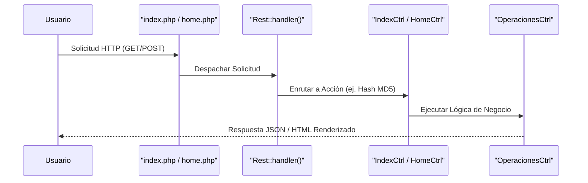
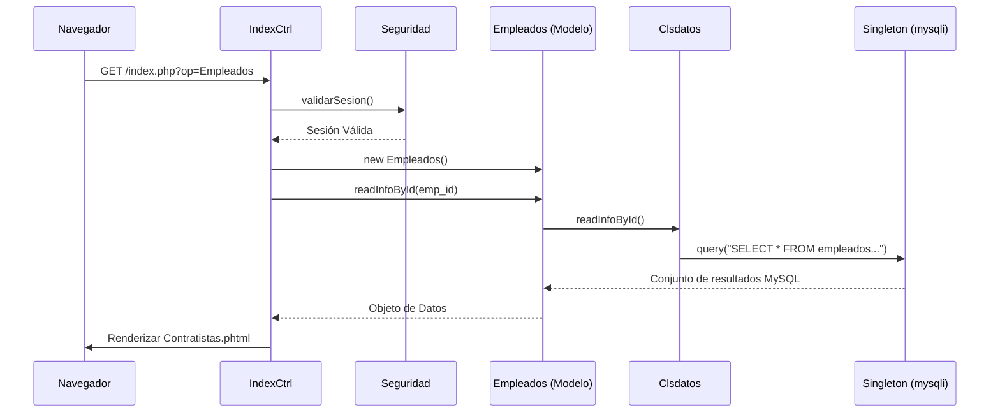
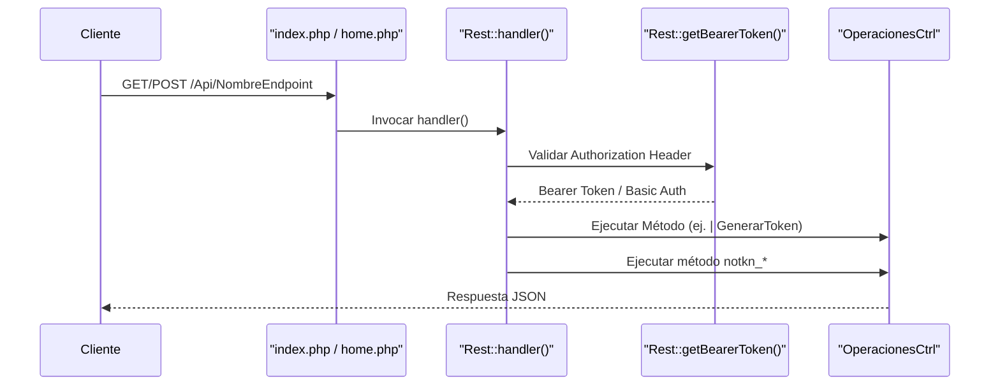
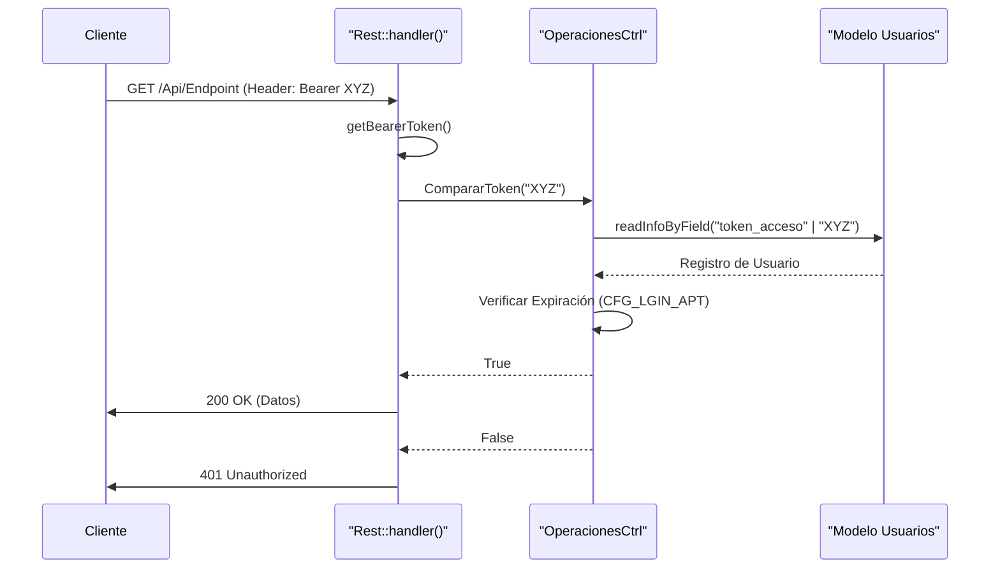
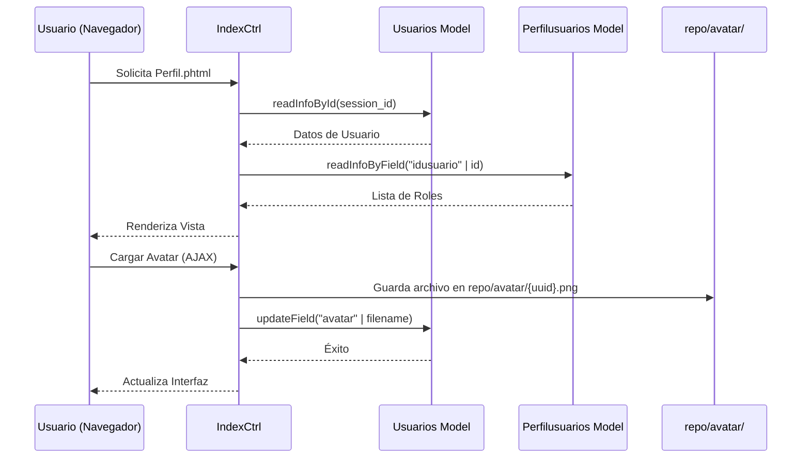
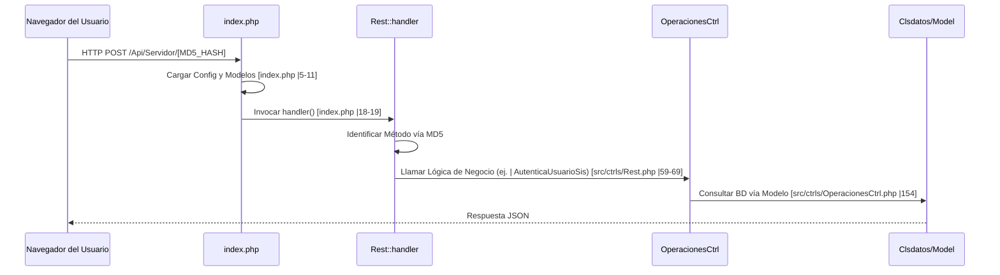
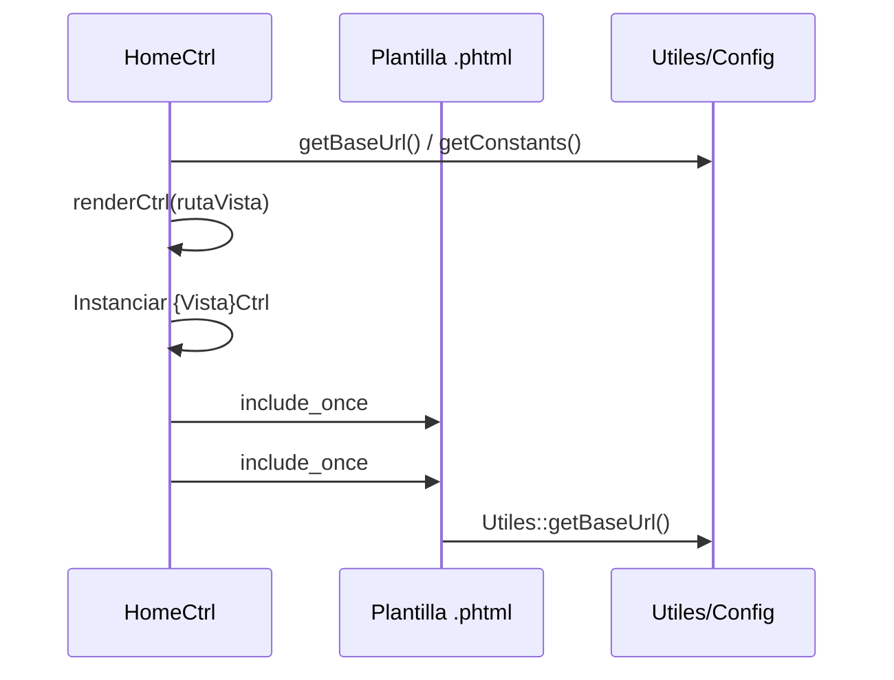

# README Técnico Consolidado — GESFINANCIERO

Documento consolidado a partir de los archivos Markdown exportados desde la wiki técnica de Devin para el proyecto `JARDIN-BOTANICO-JCM/gesfinanciero`.

Fecha de consolidación: 2026-06-09

> Nota de seguridad: se redactaron valores que parecen contraseñas, tokens, secretos o claves privadas cuando aparecían como ejemplos o constantes en la documentación. El equipo de desarrollo debe configurar estos valores mediante variables de entorno, gestor de secretos o archivos de configuración locales no versionados.

## Índice

- [01. Visión General de GESFINANCIERO](#01-vision-general-de-gesfinanciero)
- [02. Primeros Pasos](#02-primeros-pasos)
- [03. Arquitectura Core](#03-arquitectura-core)
- [04. API REST](#04-api-rest)
- [05. Autenticación y Gestión de Tokens](#05-autenticacion-y-gestion-de-tokens)
- [06. Referencia de Endpoints de la API](#06-referencia-de-endpoints-de-la-api)
- [07. Formularios y Requerimientos](#07-formularios-y-requerimientos)
- [08. Gestión de Usuarios y Perfiles](#08-gestion-de-usuarios-y-perfiles)
- [09. Sistema de Correo y Notificaciones](#09-sistema-de-correo-y-notificaciones)
- [10. SMTP mediante PHPMailer](#10-smtp-mediante-phpmailer)
- [11. SetaPDF — Firmas Digitales](#11-setapdf-firmas-digitales)
- [12. Subdirectorios de Almacenamiento de Archivos](#12-subdirectorios-de-almacenamiento-de-archivos)
- [13. Glosario](#13-glosario)
- [14. Glosario](#14-glosario)
- [15. Almacenamiento del Repositorio (repo/)](#15-almacenamiento-del-repositorio-repo)
- [16. Configuración Corporativa (repo/corp)](#16-configuracion-corporativa-repocorp)
- [17. Librerías de Terceros (src/libs)](#17-librerias-de-terceros-srclibs)
- [18. Plantillas de Diseño (Layouts)](#18-plantillas-de-diseno-layouts)
- [19. Plantillas de Vista (src/tpls)](#19-plantillas-de-vista-srctpls)

## Archivos consolidados

- `Visión-General-de-GESFINANCIERO.md`
- `Primeros-Pasos.md`
- `Arquitectura-Core.md`
- `API-REST.md`
- `Autenticación-y-Gestión-de-Tokens.md`
- `Referencia-de-Endpoints-de-la-API.md`
- `Formularios-y-Requerimientos.md`
- `Gestión-de-Usuarios-y-Perfiles.md`
- `Sistema-de-Correo-y-Notificaciones.md`
- `SMTP-mediante-PHPMailer.md`
- `SetaPDF-—-Firmas-Digitales.md`
- `Subdirectorios-de-Almacenamiento-de-Archivos.md`
- `Glosario.md`
- `Glosario-1.md`
- `Almacenamiento-del-Repositorio-(repo-).md`
- `Configuración-Corporativa-(repo-corp).md`
- `Librerías-de-Terceros-(src-libs).md`
- `Plantillas-de-Diseño-(Layouts).md`
- `Plantillas-de-Vista-(src-tpls).md`

## Archivos referenciados en el índice original pero no cargados en esta conversación

- `Puntos-de-Entrada-de-la-Aplicación.md`
- `Módulos-de-Negocio.md`
- `Gestión-de-Empleados-y-Contratistas.md`
- `Gestión-de-Flujos-y-Firmas.md`
- `Generación-de-Documentos-y-Plantillas.md`
- `Motor-de-Plantillas-de-Correo.md`
- `TCPDF-—-Generación-de-PDF.md`
- `Otras-Librerías.md`
- `Utilidades-JavaScript-Personalizadas.md`
- `Librerías-de-UI-Incluidas.md`
- `Glosario-2.md`


---

## 01. Visión General de GESFINANCIERO

**Archivo fuente:** `Visión-General-de-GESFINANCIERO.md`

Archivos de origen relevantes

Los siguientes archivos se utilizaron como contexto para generar esta página de la wiki:

- [.gitignore](https://github.com/JARDIN-BOTANICO-JCM/gesfinanciero/blob/de565e85/.gitignore)
- [LICENSE.txt](https://github.com/JARDIN-BOTANICO-JCM/gesfinanciero/blob/de565e85/LICENSE.txt)
- [README.md](https://github.com/JARDIN-BOTANICO-JCM/gesfinanciero/blob/de565e85/README.md?plain=1)
- [src/Version.php](https://github.com/JARDIN-BOTANICO-JCM/gesfinanciero/blob/de565e85/src/Version.php)

Esta página proporciona una introducción de alto nivel al sistema GESFINANCIERO, una plataforma de gestión financiera institucional. Cubre el propósito del sistema, el stack tecnológico principal y el diseño arquitectónico. Este documento sirve como punto de partida para que los desarrolladores y colaboradores técnicos comprendan la estructura general antes de explorar subsistemas específicos.

La versión actual del sistema es `v1.21.7.50`[src/Version.php#6](https://github.com/JARDIN-BOTANICO-JCM/gesfinanciero/blob/de565e85/src/Version.php#L6-L6)

### Propósito y Alcance

GESFINANCIERO está diseñado para gestionar flujos de trabajo financieros institucionales, aprobaciones y presupuestos. Enfatiza la transparencia y la eficiencia a través de un modelo de acceso abierto, bajo la Licencia MIT [LICENSE.txt#1-22](https://github.com/JARDIN-BOTANICO-JCM/gesfinanciero/blob/de565e85/LICENSE.txt#L1-L22) La plataforma admite despliegues tanto locales (on-premises) como en la nube, proporcionando un entorno seguro para la gestión de datos financieros sensibles.

Para una configuración técnica detallada y un análisis profundo del flujo de ejecución, consulte las siguientes páginas hijas:

- [Primeros Pasos](#1.1): Configuración, instalación y diseño de directorios.
- [Puntos de Entrada de la Aplicación](#1.2): Desglose técnico de la secuencia de bootstrap y delegación de solicitudes.

Fuentes:[README.md#55-76](https://github.com/JARDIN-BOTANICO-JCM/gesfinanciero/blob/de565e85/README.md?plain=1#L55-L76)[src/Version.php#4-7](https://github.com/JARDIN-BOTANICO-JCM/gesfinanciero/blob/de565e85/src/Version.php#L4-L7)[LICENSE.txt#1-22](https://github.com/JARDIN-BOTANICO-JCM/gesfinanciero/blob/de565e85/LICENSE.txt#L1-L22)

---

### Arquitectura de Alto Nivel

GESFINANCIERO sigue una arquitectura MVC (Modelo-Vista-Controlador) por capas. El sistema separa las responsabilidades en puntos de entrada, controladores para el manejo de solicitudes, operaciones de lógica de negocio y una capa de acceso a datos dedicada.

#### Diagrama de Arquitectura del Sistema

El siguiente diagrama ilustra la relación entre las entidades de código principales y las capas lógicas de la aplicación.

"Arquitectura del Sistema"

[Flowchart Diagram]

Fuentes:[README.md#121-164](https://github.com/JARDIN-BOTANICO-JCM/gesfinanciero/blob/de565e85/README.md?plain=1#L121-L164)

---

### Stack Tecnológico

La plataforma está construida sobre un stack moderno de PHP con un enfoque en la seguridad institucional e interoperabilidad.

| Componente | Tecnología | Descripción |
| --- | --- | --- |
| Backend | PHP 7.4+ | Lógica central de la aplicación y API. |
| Base de datos | MySQL | Almacenamiento persistente utilizando la base de datos `nuevapp_apps`. |
| Frontend | Bootstrap 5+ | Interfaz de usuario responsiva utilizando JavaScript, HTML5 y CSS3. |
| Correo | PHPMailer / MS Graph | Soporte de modo dual para servicios de correo SMTP y OAuth2. |
| Autenticación | Multimodal | Tokens Bearer, basados en sesión e integración con LDAP. |

Fuentes:[README.md#103-117](https://github.com/JARDIN-BOTANICO-JCM/gesfinanciero/blob/de565e85/README.md?plain=1#L103-L117)

---

### Módulos Clave

El sistema está organizado en módulos funcionales que manejan dominios de negocio específicos:

- Flujos de Trabajo y Firmas: Gestiona procesos de aprobación multinivel y firmas digitales utilizando SetaPDF y TCPDF.
- Gestión de Empleados y Contratistas: Rastrea al personal institucional, incluyendo seguridad social específica de Colombia (EPS/ARL) y detalles de cargos.
- Generación de Documentos: Un sistema basado en plantillas para generar PDFs y notificaciones automáticas por correo electrónico.
- Formularios y Requerimientos: Un constructor de formularios dinámicos que utiliza una sintaxis de componentes HTML personalizada.

#### Mapeo de Código a Entidades

Este diagrama mapea los módulos de negocio de alto nivel con las clases y directorios específicos que los implementan.

"Mapeo de Módulos de Negocio"

[Flowchart Diagram]

Fuentes:[README.md#83-98](https://github.com/JARDIN-BOTANICO-JCM/gesfinanciero/blob/de565e85/README.md?plain=1#L83-L98)[src/Version.php#1-7](https://github.com/JARDIN-BOTANICO-JCM/gesfinanciero/blob/de565e85/src/Version.php#L1-L7)

---

### Navegación y Estructura de la Wiki

La documentación está organizada para apoyar diferentes etapas del desarrollo:

1. Arquitectura Core: Análisis profundo de las capas del framework personalizado (Sistema, Datos, Modelo y Controlador).
2. API REST: Referencia para esquemas de autenticación y gestión de endpoints.
3. Módulos de Negocio: Lógica detallada para flujos de trabajo, documentos y gestión de usuarios.
4. Infraestructura: Configuración para sistemas de correo, librerías de terceros y activos de frontend.
5. Almacenamiento del Repositorio: Explicación del directorio `repo/` y la seguridad de los archivos.

Fuentes:[README.md#4-50](https://github.com/JARDIN-BOTANICO-JCM/gesfinanciero/blob/de565e85/README.md?plain=1#L4-L50)


---

## 02. Primeros Pasos

**Archivo fuente:** `Primeros-Pasos.md`

Archivos de origen relevantes

Los siguientes archivos se utilizaron como contexto para generar esta página de la wiki:

- [.gitignore](https://github.com/JARDIN-BOTANICO-JCM/gesfinanciero/blob/de565e85/.gitignore)
- [README.md](https://github.com/JARDIN-BOTANICO-JCM/gesfinanciero/blob/de565e85/README.md?plain=1)
- [repo/corp/Corporation.php](https://github.com/JARDIN-BOTANICO-JCM/gesfinanciero/blob/de565e85/repo/corp/Corporation.php)

Esta página proporciona una guía completa para configurar el entorno de desarrollo de GESFINANCIERO. Cubre la inicialización del repositorio, la gestión de dependencias, la configuración del entorno y una visión general de la estructura de directorios del sistema.

### 1. Instalación y Configuración

Para poner en marcha el sistema GESFINANCIERO localmente o en un servidor, siga estos pasos para clonar el repositorio y configurar el entorno.

#### 1.1 Clonar el Repositorio

Clone el proyecto desde el repositorio oficial de GitHub:

```
git clone https://github.com/JARDIN-BOTANICO-JCM/gesfinanciero.git
cd gesfinanciero
```

#### 1.2 Gestión de Dependencias

El proyecto utiliza dependencias tanto de PHP (Composer) como de JavaScript (NPM). Asegúrese de tener instaladas las últimas versiones estables de PHP (7.4+) y Node.js.

1. Dependencias de PHP: Ejecute Composer para instalar las librerías del backend, incluyendo PHPMailer y la integración con Microsoft Graph.

```
composer install
```
2. Dependencias del Frontend: Instale los paquetes de NPM para las herramientas de compilación y los componentes de la interfaz de usuario (UI).

```
npm install
```

Sources:[.gitignore#12-13](https://github.com/JARDIN-BOTANICO-JCM/gesfinanciero/blob/de565e85/.gitignore#L12-L13)[README.md#109-115](https://github.com/JARDIN-BOTANICO-JCM/gesfinanciero/blob/de565e85/README.md?plain=1#L109-L115)

---

### 2. Configuración del Entorno

GESFINANCIERO utiliza una clase de configuración centralizada ubicada en el directorio `repo/corp/` para gestionar las conexiones a la base de datos y los ajustes del servidor de correo.

#### 2.1 Configuración de Base de Datos y Correo

La configuración se maneja a través de la clase `Corporation`. Debe modificar `repo/corp/Corporation.php` para que coincida con las credenciales de su entorno.

| Constante | Descripción | Valor por Defecto |
| --- | --- | --- |
| `HOST` | Dirección del host de la base de datos | `db` |
| `DBUSER` | Usuario de la base de datos | `rootapps` |
| `DBPASS` | Contraseña de la base de datos | `[REDACTADO]` |
| `DBNAME` | Nombre de la base de datos destino | `nuevapp_apps` |
| `MAIL_HOST` | Servidor SMTP para notificaciones | `smtp.ipage.com` |
| `MAIL_PORT` | Puerto SMTP | `25` |

Sources:[repo/corp/Corporation.php#1-22](https://github.com/JARDIN-BOTANICO-JCM/gesfinanciero/blob/de565e85/repo/corp/Corporation.php#L1-L22)

#### 2.2 Flujo de Inicialización del Sistema

El siguiente diagrama ilustra cómo se carga la configuración durante el proceso de arranque (bootstrap) de la aplicación.

Diagrama: Flujo de Arranque de Configuración

[Flowchart Diagram]

Sources:[repo/corp/Corporation.php#7-20](https://github.com/JARDIN-BOTANICO-JCM/gesfinanciero/blob/de565e85/repo/corp/Corporation.php#L7-L20)[README.md#129-164](https://github.com/JARDIN-BOTANICO-JCM/gesfinanciero/blob/de565e85/README.md?plain=1#L129-L164)

---

### 3. Estructura de Directorios

El repositorio está organizado en capas específicas para separar la lógica de negocio, el acceso a datos y los activos públicos.

#### 3.1 Estructura del Núcleo de Directorios

| Ruta | Propósito |
| --- | --- |
| `src/ctrls/` | Contiene las clases Controladoras (`IndexCtrl`, `HomeCtrl`, `Rest`). |
| `src/modelo/` | Modelos de dominio que heredan de `Clsdatos`. |
| `src/datos/` | Capa de acceso a datos (`Singleton`, `Clsdatos`). |
| `src/sistema/` | Utilidades del núcleo del framework (`Config`, `Seguridad`, `Utiles`). |
| `src/tpls/` | Plantillas de vista (archivos `.phtml`). |
| `temas/` | Activos del frontend (CSS, JS, librerías Bootstrap 5). |
| `repo/` | Almacenamiento en tiempo de ejecución para subidas y configuración corporativa. |

#### 3.2 Almacenamiento en Tiempo de Ejecución (`repo/`)

El directorio `repo/` contiene datos sensibles y generados. Utiliza un patrón específico en `.gitignore` para asegurar que las estructuras de directorios existan en el control de versiones mientras se ignoran los archivos subidos reales.

- `repo/corp/`: Contiene `Corporation.php` y `cacert.pem`.
- `repo/avatar/`: Imágenes de perfil de usuario.
- `repo/anexos/`: Archivos adjuntos de documentos.
- `repo/debug/`: Artefactos temporales de PDF y registros (logs).

Sources:[.gitignore#16-30](https://github.com/JARDIN-BOTANICO-JCM/gesfinanciero/blob/de565e85/.gitignore#L16-L30)[README.md#145-156](https://github.com/JARDIN-BOTANICO-JCM/gesfinanciero/blob/de565e85/README.md?plain=1#L145-L156)

---

### 4. Lógica de Ejecución

GESFINANCIERO opera a través de dos puntos de entrada principales: `index.php` (Aplicación Principal) y `home.php` (Público/Landing).

#### 4.1 Despacho de Solicitudes

El sistema mapea las solicitudes entrantes a los controladores basándose en el `PATH_INFO`.

Diagrama: Mapeo de Punto de Entrada a Controlador



Sources:[README.md#129-143](https://github.com/JARDIN-BOTANICO-JCM/gesfinanciero/blob/de565e85/README.md?plain=1#L129-L143)[README.md#163-164](https://github.com/JARDIN-BOTANICO-JCM/gesfinanciero/blob/de565e85/README.md?plain=1#L163-L164)

#### 4.2 Ejecución del Servidor de Desarrollo

Para iniciar la aplicación utilizando el servidor integrado de PHP:

```
php -S localhost:8000
```

Acceda a la aplicación en `http://localhost:8000/index.php`.

Sources:[README.md#109-112](https://github.com/JARDIN-BOTANICO-JCM/gesfinanciero/blob/de565e85/README.md?plain=1#L109-L112)


---

## 03. Arquitectura Core

**Archivo fuente:** `Arquitectura-Core.md`

Archivos de origen relevantes

Los siguientes archivos se utilizaron como contexto para generar esta página de la wiki:

- [home.php](https://github.com/JARDIN-BOTANICO-JCM/gesfinanciero/blob/de565e85/home.php)
- [index.php](https://github.com/JARDIN-BOTANICO-JCM/gesfinanciero/blob/de565e85/index.php)
- [src/ctrls/IndexCtrl.php](https://github.com/JARDIN-BOTANICO-JCM/gesfinanciero/blob/de565e85/src/ctrls/IndexCtrl.php)

GESFINANCIERO está construido sobre un framework Model-View-Controller (MVC) de PHP personalizado, diseñado para la gestión financiera y flujos de trabajo de firma digital. La arquitectura está organizada en capas distintas que separan las utilidades del sistema, la persistencia de datos, la lógica de dominio y la orquestación de solicitudes.

El sistema utiliza dos puntos de entrada principales: `index.php`[index.php#1-19](https://github.com/JARDIN-BOTANICO-JCM/gesfinanciero/blob/de565e85/index.php#L1-L19) para la aplicación principal y `home.php`[home.php#1-19](https://github.com/JARDIN-BOTANICO-JCM/gesfinanciero/blob/de565e85/home.php#L1-L19) para interacciones externas/públicas. Ambos archivos inicializan el entorno cargando las clases core del sistema y los modelos de dominio antes de delegar a sus respectivos controladores.

#### Visión General Arquitectónica

El siguiente diagrama ilustra la interacción entre las capas core y cómo se mapean con las entidades de código específicas.

Flujo MVC e Interacción de Capas

[Flowchart Diagram]

Sources:[index.php#1-19](https://github.com/JARDIN-BOTANICO-JCM/gesfinanciero/blob/de565e85/index.php#L1-L19)[home.php#1-19](https://github.com/JARDIN-BOTANICO-JCM/gesfinanciero/blob/de565e85/home.php#L1-L19)[src/ctrls/IndexCtrl.php#36](https://github.com/JARDIN-BOTANICO-JCM/gesfinanciero/blob/de565e85/src/ctrls/IndexCtrl.php#L36-L36)

---

#### 2.1 Capa de Sistema (`src/sistema`)

La Capa de Sistema proporciona la infraestructura fundamental para la aplicación. Maneja aspectos transversales como la seguridad de la sesión, el cifrado, los ayudantes de renderizado HTML y la configuración global.

- `Seguridad`: Gestiona la autenticación de usuarios, el ciclo de vida de la sesión y el cifrado Rijndael para datos sensibles.
- `Config`: Define constantes para todo el sitio y configuraciones específicas del entorno.
- `Pagina`: La clase base para los controladores, que proporciona métodos para la paginación y el renderizado de tablas HTML.
- `Utiles`: Una suite de utilidades para operaciones del sistema de archivos, generación de UUID e inclusión dinámica de archivos.

Para más detalles, consulte [Capa de Sistema (src/sistema)](#2.1).

Sources:[index.php#5-8](https://github.com/JARDIN-BOTANICO-JCM/gesfinanciero/blob/de565e85/index.php#L5-L8)[index.php#12-15](https://github.com/JARDIN-BOTANICO-JCM/gesfinanciero/blob/de565e85/index.php#L12-L15)[src/ctrls/IndexCtrl.php#36](https://github.com/JARDIN-BOTANICO-JCM/gesfinanciero/blob/de565e85/src/ctrls/IndexCtrl.php#L36-L36)

---

#### 2.2 Capa de Acceso a Datos (`src/datos`)

La Capa de Acceso a Datos abstrae las interacciones con la base de datos. Utiliza un patrón Singleton para gestionar un pool de conexiones `mysqli` y proporciona una clase base para todos los modelos de dominio.

- `Singleton`: Lee las credenciales de la base de datos desde `repo/corp/Corporation.php` para establecer y compartir una única conexión a la base de datos.
- `Clsdatos`: Actúa como una clase base de tipo ORM. Proporciona métodos estandarizados para operaciones CRUD, como `readInfoById`, `saveData` y `deleteByField`.

Para más detalles, consulte [Capa de Acceso a Datos (src/datos)](#2.2).

Sources:[index.php#9-10](https://github.com/JARDIN-BOTANICO-JCM/gesfinanciero/blob/de565e85/index.php#L9-L10)[home.php#9-10](https://github.com/JARDIN-BOTANICO-JCM/gesfinanciero/blob/de565e85/home.php#L9-L10)

---

#### 2.3 Modelos de Dominio (`src/modelo`)

Los modelos de dominio representan las entidades de negocio del sistema GESFINANCIERO. Existen más de 40 clases de modelos que heredan de `Clsdatos`, lo que les permite interactuar con la base de datos utilizando métodos de alto nivel.

Entidades de Dominio Clave

| Categoría | Modelos Principales |
| --- | --- |
| Personal | `Empleados`, `Usuarios`, `Dependencias`, `Cargos` |
| Flujo de Trabajo | `Flujos`, `Flujositems`, `Firmas`, `Paquetes` |
| Captura de Datos | `Formularios`, `Requerimientostpls`, `Requerimientostplsitems` |
| Búsquedas (Lookups) | `Tipodoc`, `Generos`, `Lugares`, `Eps`, `Arl` |

Para más detalles, consulte [Modelos de Dominio (src/modelo)](#2.3).

Sources:[index.php#11](https://github.com/JARDIN-BOTANICO-JCM/gesfinanciero/blob/de565e85/index.php#L11-L11)[home.php#11](https://github.com/JARDIN-BOTANICO-JCM/gesfinanciero/blob/de565e85/home.php#L11-L11)

---

#### 2.4 Controladores (`src/ctrls`)

Los controladores orquestan la lógica de la aplicación procesando las solicitudes entrantes, interactuando con los modelos y seleccionando las plantillas de vista adecuadas.

- `IndexCtrl`: El enrutador principal para el espacio de trabajo autenticado. Define todos los endpoints de la API como constantes con hash MD5 y gestiona los perfiles de usuario (ej., `PERFILES_ADMINISTRADOR`, `PERFILES_CONTRATISTA`).
- `HomeCtrl`: Maneja la parte pública de la aplicación, incluyendo la autenticación externa y las páginas de inicio (landing pages).
- `Rest`: Un manejador especializado para solicitudes de API RESTful, que admite tanto tokens Bearer como Basic Auth.
- `OperacionesCtrl`: Contiene la lógica de negocio principal, como el envío de correos electrónicos, la generación de documentos y la integración con las listas de seguridad social colombiana (EPS/ARL).

Para más detalles, consulte [Controladores (src/ctrls)](#2.4).

Sources:[src/ctrls/IndexCtrl.php#36-54](https://github.com/JARDIN-BOTANICO-JCM/gesfinanciero/blob/de565e85/src/ctrls/IndexCtrl.php#L36-L54)[index.php#16-19](https://github.com/JARDIN-BOTANICO-JCM/gesfinanciero/blob/de565e85/index.php#L16-L19)[home.php#16-19](https://github.com/JARDIN-BOTANICO-JCM/gesfinanciero/blob/de565e85/home.php#L16-L19)

---

#### Diagrama del Ciclo de Vida de una Solicitud

Este diagrama muestra cómo fluye una solicitud de un registro de empleado a través de las entidades del sistema.

Flujo de Solicitud de Entidad de Código



Sources:[index.php#18-19](https://github.com/JARDIN-BOTANICO-JCM/gesfinanciero/blob/de565e85/index.php#L18-L19)[src/ctrls/IndexCtrl.php#36](https://github.com/JARDIN-BOTANICO-JCM/gesfinanciero/blob/de565e85/src/ctrls/IndexCtrl.php#L36-L36)[src/datos/Clsdatos.php](https://github.com/JARDIN-BOTANICO-JCM/gesfinanciero/blob/de565e85/src/datos/Clsdatos.php) (conceptual)


---

## 04. API REST

**Archivo fuente:** `API-REST.md`

Archivos de origen relevantes

Los siguientes archivos se utilizaron como contexto para generar esta página de la wiki:

- [src/ctrls/HomeCtrl.php](https://github.com/JARDIN-BOTANICO-JCM/gesfinanciero/blob/de565e85/src/ctrls/HomeCtrl.php)
- [src/ctrls/IndexCtrl.php](https://github.com/JARDIN-BOTANICO-JCM/gesfinanciero/blob/de565e85/src/ctrls/IndexCtrl.php)
- [src/ctrls/Rest.php](https://github.com/JARDIN-BOTANICO-JCM/gesfinanciero/blob/de565e85/src/ctrls/Rest.php)

El sistema GESFINANCIERO expone una superficie de API REST integral utilizada tanto para operaciones AJAX internas como para integraciones externas. La API es accesible a través de los puntos de entrada `index.php` y `home.php`, utilizando `PATH_INFO` para el enrutamiento y un controlador personalizado para despachar las solicitudes a la lógica de negocio.

#### Arquitectura y Enrutamiento de la API

La API no utiliza un sistema de enrutamiento tradicional basado en directorios. En su lugar, aprovecha la variable de servidor `PATH_INFO` para interceptar solicitudes en los puntos de entrada principales [src/ctrls/HomeCtrl.php#64-69](https://github.com/JARDIN-BOTANICO-JCM/gesfinanciero/blob/de565e85/src/ctrls/HomeCtrl.php#L64-L69) Todas las solicitudes de la API se centralizan a través de `Rest::handler()`, que actúa como el despachador primario [src/ctrls/Rest.php#211-267](https://github.com/JARDIN-BOTANICO-JCM/gesfinanciero/blob/de565e85/src/ctrls/Rest.php#L211-L267)

Características Clave:

- Nomenclatura de Endpoints: Muchos endpoints internos se referencian utilizando cadenas con hash MD5 de sus nombres lógicos (por ejemplo, `md5("Api/Servidor/AutenticaUsuarioSis")`) para proporcionar una capa de ofuscación para las llamadas AJAX del lado del cliente [src/ctrls/IndexCtrl.php#218](https://github.com/JARDIN-BOTANICO-JCM/gesfinanciero/blob/de565e85/src/ctrls/IndexCtrl.php#L218-L218)
- Delegación del Controlador: La clase `Rest` maneja los aspectos específicos del protocolo HTTP (encabezados, códigos de estado) y delega la lógica de negocio real a `OperacionesCtrl` o `OperacionesHomeCtrl`[src/ctrls/Rest.php#15-25](https://github.com/JARDIN-BOTANICO-JCM/gesfinanciero/blob/de565e85/src/ctrls/Rest.php#L15-L25)
- Formato de Datos: La API consume y produce `application/json`[src/ctrls/Rest.php#228](https://github.com/JARDIN-BOTANICO-JCM/gesfinanciero/blob/de565e85/src/ctrls/Rest.php#L228-L228)

##### Diagrama de Flujo de Solicitud

El siguiente diagrama ilustra cómo se mueve una solicitud desde el punto de entrada a través de la lógica de enrutamiento hasta la operación de negocio final.

Secuencia de Despacho de la API



Sources: [src/ctrls/HomeCtrl.php#64-69](https://github.com/JARDIN-BOTANICO-JCM/gesfinanciero/blob/de565e85/src/ctrls/HomeCtrl.php#L64-L69)[src/ctrls/Rest.php#211-267](https://github.com/JARDIN-BOTANICO-JCM/gesfinanciero/blob/de565e85/src/ctrls/Rest.php#L211-L267)[src/ctrls/Rest.php#162-172](https://github.com/JARDIN-BOTANICO-JCM/gesfinanciero/blob/de565e85/src/ctrls/Rest.php#L162-L172)

---

#### Esquemas de Autenticación

La API admite dos modos de autenticación principales según la categoría del endpoint:

1. HTTP Basic Auth: Utilizado principalmente para la generación inicial del token. Los usuarios proporcionan credenciales a través del encabezado `Authorization: Basic` al endpoint `GenerarToken`[src/ctrls/Rest.php#178-194](https://github.com/JARDIN-BOTANICO-JCM/gesfinanciero/blob/de565e85/src/ctrls/Rest.php#L178-L194)
2. Bearer Token (tipo JWT): Las solicitudes posteriores utilizan un token proporcionado en el encabezado `Authorization: Bearer`. El sistema valida este token utilizando `OperacionesCtrl::CompararToken`[src/ctrls/Rest.php#162-172](https://github.com/JARDIN-BOTANICO-JCM/gesfinanciero/blob/de565e85/src/ctrls/Rest.php#L162-L172)
3. Endpoints sin Token: Endpoints específicos orientados al público o a nivel de sistema (con el prefijo `notkn_`) omiten la verificación de token estándar, a menudo para procesos como la recuperación de contraseñas o la revisión de documentos externos [src/ctrls/Rest.php#73-113](https://github.com/JARDIN-BOTANICO-JCM/gesfinanciero/blob/de565e85/src/ctrls/Rest.php#L73-L113)

Para obtener detalles sobre la implementación y la seguridad de la sesión, consulte [Autenticación y Gestión de Tokens](#3.1).

---

#### Categorías de Endpoints

Los endpoints se definen como constantes dentro de `IndexCtrl` y se mapean en la lógica switch-case de `Rest::handler()`. Se dividen en dos categorías funcionales principales:

| Categoría | Prefijo/Lógica | Propósito |
| --- | --- | --- |
| Token Requerido | `tkn_` | Tareas administrativas, operaciones CRUD en empleados, usuarios y flujos financieros. |
| Sin Token | `notkn_` | Verificación pública de documentos, comprobaciones de comunicación por correo electrónico y secuencias de inicio de sesión inicial. |
| AJAX con Hash | Cadenas MD5 | Operaciones internas del sistema activadas por la interfaz de usuario del frontend. |

Mapeo de Entidades de Código
El siguiente diagrama mapea las categorías lógicas de la API con las constantes de clase y los métodos específicos en el código base.

Mapeo de Entidades de la API

[Flowchart Diagram]

Sources: [src/ctrls/IndexCtrl.php#211-300](https://github.com/JARDIN-BOTANICO-JCM/gesfinanciero/blob/de565e85/src/ctrls/IndexCtrl.php#L211-L300)[src/ctrls/Rest.php#211-267](https://github.com/JARDIN-BOTANICO-JCM/gesfinanciero/blob/de565e85/src/ctrls/Rest.php#L211-L267)[src/ctrls/Rest.php#74-75](https://github.com/JARDIN-BOTANICO-JCM/gesfinanciero/blob/de565e85/src/ctrls/Rest.php#L74-L75)

---

#### Enlaces de Documentación de la API

Para especificaciones detalladas de los endpoints disponibles y los flujos de autenticación, consulte las siguientes subpáginas:

- [Autenticación y Gestión de Tokens](#3.1): Flujo detallado de autenticación Basic vs. Bearer, configuración de expiración de tokens (`CFG_LGIN_APT`) y lógica de recuperación de contraseñas.
- [Referencia de Endpoints de la API](#3.2): Una lista completa de todos los endpoints con nombre y hash MD5, incluidos los parámetros para la gestión de Empleados, Flujos (`flujos`), Firmas Digitales y plantillas de Formularios.

Sources: [src/ctrls/IndexCtrl.php#211-315](https://github.com/JARDIN-BOTANICO-JCM/gesfinanciero/blob/de565e85/src/ctrls/IndexCtrl.php#L211-L315)[src/ctrls/Rest.php#1-267](https://github.com/JARDIN-BOTANICO-JCM/gesfinanciero/blob/de565e85/src/ctrls/Rest.php#L1-L267)


---

## 05. Autenticación y Gestión de Tokens

**Archivo fuente:** `Autenticación-y-Gestión-de-Tokens.md`

Archivos de origen relevantes

Los siguientes archivos se utilizaron como contexto para generar esta página de la wiki:

- [src/ctrls/IndexCtrl.php](https://github.com/JARDIN-BOTANICO-JCM/gesfinanciero/blob/de565e85/src/ctrls/IndexCtrl.php)
- [src/ctrls/OperacionesCtrl.php](https://github.com/JARDIN-BOTANICO-JCM/gesfinanciero/blob/de565e85/src/ctrls/OperacionesCtrl.php)
- [src/ctrls/Rest.php](https://github.com/JARDIN-BOTANICO-JCM/gesfinanciero/blob/de565e85/src/ctrls/Rest.php)

Esta página detalla los mecanismos de autenticación y el ciclo de vida de la gestión de tokens dentro de GESFINANCIERO. El sistema admite múltiples flujos de autenticación, incluido el inicio de sesión estándar basado en sesiones para la interfaz web, HTTP Basic Auth para la adquisición inicial de tokens y la validación de tokens Bearer para las interacciones con la API REST.

### Flujos de Autenticación

El sistema implementa distintos flujos basados en el punto de entrada y la naturaleza de la solicitud (UI Web vs. API).

#### 1. Autenticación de Sesión Web

Se utiliza para el acceso estándar basado en el navegador. El proceso es gestionado por la clase `Seguridad` y `OperacionesCtrl`.

- Método de Login: `Seguridad::loginAdmin($usuario, $clave)`[src/sistema/Seguridad.php#123-145](https://github.com/JARDIN-BOTANICO-JCM/gesfinanciero/blob/de565e85/src/sistema/Seguridad.php#L123-L145) Verifica las credenciales contra la tabla `usuarios` e inicializa la sesión de PHP.
- Login AJAX Base64: `OperacionesCtrl::AutenticaUsuarioSisAjaxB64($data)`[src/ctrls/OperacionesCtrl.php#336-350](https://github.com/JARDIN-BOTANICO-JCM/gesfinanciero/blob/de565e85/src/ctrls/OperacionesCtrl.php#L336-L350) maneja las solicitudes de inicio de sesión donde las credenciales se proporcionan en formato Base64, comúnmente utilizado por el frontend `utilidades.js`[temas/js/utilidades.js#10-25](https://github.com/JARDIN-BOTANICO-JCM/gesfinanciero/blob/de565e85/temas/js/utilidades.js#L10-L25)

#### 2. Autenticación de API REST (Token Bearer)

La API REST utiliza un mecanismo de token Bearer sin estado (stateless).

- Generación de Tokens: Los clientes deben autenticarse primero a través de HTTP Basic Auth en el endpoint `GenerarToken`. El método `Rest::getAuthBasic()`[src/ctrls/Rest.php#178-194](https://github.com/JARDIN-BOTANICO-JCM/gesfinanciero/blob/de565e85/src/ctrls/Rest.php#L178-L194) extrae las credenciales del encabezado `Authorization`.
- Validación de Tokens: Las solicitudes posteriores deben incluir un token `Bearer`. `Rest::getBearerToken()`[src/ctrls/Rest.php#162-172](https://github.com/JARDIN-BOTANICO-JCM/gesfinanciero/blob/de565e85/src/ctrls/Rest.php#L162-L172) analiza el encabezado, y `OperacionesCtrl::CompararToken($token)`[src/ctrls/OperacionesCtrl.php#1150-1175](https://github.com/JARDIN-BOTANICO-JCM/gesfinanciero/blob/de565e85/src/ctrls/OperacionesCtrl.php#L1150-L1175) lo valida contra la base de datos.
- Expiración de Tokens: La validez del token se rige por el valor de configuración `CFG_LGIN_APT`, que define la vida útil de una sesión de token activa [src/sistema/Config.php#45-55](https://github.com/JARDIN-BOTANICO-JCM/gesfinanciero/blob/de565e85/src/sistema/Config.php#L45-L55)

#### 3. Recuperación de Contraseña

Se maneja a través de un proceso de verificación por correo electrónico de dos pasos.

- Solicitud: `Rest::RecuperarByEmail($data)`[src/ctrls/Rest.php#39-49](https://github.com/JARDIN-BOTANICO-JCM/gesfinanciero/blob/de565e85/src/ctrls/Rest.php#L39-L49) activa `OperacionesCtrl::RecuperarByEmailAjax`[src/ctrls/OperacionesCtrl.php#210-235](https://github.com/JARDIN-BOTANICO-JCM/gesfinanciero/blob/de565e85/src/ctrls/OperacionesCtrl.php#L210-L235) que genera un token temporal utilizando la librería `MagicPagesLib`[src/libs/MagicPages/MagicPagesLib.php#10-30](https://github.com/JARDIN-BOTANICO-JCM/gesfinanciero/blob/de565e85/src/libs/MagicPages/MagicPagesLib.php#L10-L30)
- Asignación: `Rest::RecuAsignarClave($data)`[src/ctrls/Rest.php#15-25](https://github.com/JARDIN-BOTANICO-JCM/gesfinanciero/blob/de565e85/src/ctrls/Rest.php#L15-L25) permite al usuario establecer una nueva contraseña una vez que se valida el token de recuperación.

---

### Implementación Técnica: Espacio de Entidades de Código

El siguiente diagrama mapea los conceptos lógicos de autenticación con las clases y métodos específicos implementados en la base de código.

Diagrama: Mapeo de la Lógica de Autenticación

[Flowchart Diagram]

Sources:[src/ctrls/Rest.php#15-200](https://github.com/JARDIN-BOTANICO-JCM/gesfinanciero/blob/de565e85/src/ctrls/Rest.php#L15-L200)[src/ctrls/OperacionesCtrl.php#336-350](https://github.com/JARDIN-BOTANICO-JCM/gesfinanciero/blob/de565e85/src/ctrls/OperacionesCtrl.php#L336-L350)[src/sistema/Seguridad.php#123-145](https://github.com/JARDIN-BOTANICO-JCM/gesfinanciero/blob/de565e85/src/sistema/Seguridad.php#L123-L145)

---

### Gestión del Ciclo de Vida del Token

El sistema gestiona los tokens dentro de la tabla `usuarios`, rastreando el `token_acceso` y su última actividad.

| Función | Propósito | Referencia de Archivo |
| --- | --- | --- |
| `GenerarToken` | Crea un nuevo token basado en UUID después de la validación Basic Auth. | [src/ctrls/OperacionesCtrl.php#1120-1145](https://github.com/JARDIN-BOTANICO-JCM/gesfinanciero/blob/de565e85/src/ctrls/OperacionesCtrl.php#L1120-L1145) |
| `CompararToken` | Verifica si un token Bearer existe y no ha expirado. | [src/ctrls/OperacionesCtrl.php#1150-1175](https://github.com/JARDIN-BOTANICO-JCM/gesfinanciero/blob/de565e85/src/ctrls/OperacionesCtrl.php#L1150-L1175) |
| `getBearerToken` | Extrae el token del encabezado `Authorization: Bearer <token>`. | [src/ctrls/Rest.php#162-172](https://github.com/JARDIN-BOTANICO-JCM/gesfinanciero/blob/de565e85/src/ctrls/Rest.php#L162-L172) |
| `loginAdmin` | Lógica central de autenticación basada en sesiones. | [src/sistema/Seguridad.php#123-145](https://github.com/JARDIN-BOTANICO-JCM/gesfinanciero/blob/de565e85/src/sistema/Seguridad.php#L123-L145) |

#### Flujo de Datos: Validación de Token de API

La siguiente secuencia describe cómo se autoriza una solicitud de API protegida.

Diagrama: Flujo de Validación de Token Bearer



Sources:[src/ctrls/Rest.php#215-250](https://github.com/JARDIN-BOTANICO-JCM/gesfinanciero/blob/de565e85/src/ctrls/Rest.php#L215-L250)[src/ctrls/OperacionesCtrl.php#1150-1175](https://github.com/JARDIN-BOTANICO-JCM/gesfinanciero/blob/de565e85/src/ctrls/OperacionesCtrl.php#L1150-L1175)[src/sistema/Config.php#45-55](https://github.com/JARDIN-BOTANICO-JCM/gesfinanciero/blob/de565e85/src/sistema/Config.php#L45-L55)

---

### Constantes de Seguridad y Errores

La clase `IndexCtrl` define varias constantes utilizadas durante el proceso de autenticación para señalar el estado o errores.

- `USABILIDAD_MSJ_LOGINOK`: "ingreso login correcto" [src/ctrls/IndexCtrl.php#72](https://github.com/JARDIN-BOTANICO-JCM/gesfinanciero/blob/de565e85/src/ctrls/IndexCtrl.php#L72-L72)
- `ERR_COD_SESION_INACTIVA`: Código `529`, devuelto cuando una sesión o token ha expirado [src/ctrls/IndexCtrl.php#168](https://github.com/JARDIN-BOTANICO-JCM/gesfinanciero/blob/de565e85/src/ctrls/IndexCtrl.php#L168-L168)
- `ERR_COD_EST_CLAVE_NO_MODIFICADA`: Código `531`, devuelto durante fallos en el restablecimiento de contraseña [src/ctrls/IndexCtrl.php#186](https://github.com/JARDIN-BOTANICO-JCM/gesfinanciero/blob/de565e85/src/ctrls/IndexCtrl.php#L186-L186)

Sources:[src/ctrls/IndexCtrl.php#70-200](https://github.com/JARDIN-BOTANICO-JCM/gesfinanciero/blob/de565e85/src/ctrls/IndexCtrl.php#L70-L200)


---

## 06. Referencia de Endpoints de la API

**Archivo fuente:** `Referencia-de-Endpoints-de-la-API.md`

Archivos de origen relevantes

Los siguientes archivos se utilizaron como contexto para generar esta página de la wiki:

- [src/ctrls/IndexCtrl.php](https://github.com/JARDIN-BOTANICO-JCM/gesfinanciero/blob/de565e85/src/ctrls/IndexCtrl.php)
- [src/ctrls/OperacionesCtrl.php](https://github.com/JARDIN-BOTANICO-JCM/gesfinanciero/blob/de565e85/src/ctrls/OperacionesCtrl.php)
- [src/ctrls/Rest.php](https://github.com/JARDIN-BOTANICO-JCM/gesfinanciero/blob/de565e85/src/ctrls/Rest.php)
- [src/libs/Apibox/ApiboxLib.php](https://github.com/JARDIN-BOTANICO-JCM/gesfinanciero/blob/de565e85/src/libs/Apibox/ApiboxLib.php)

Esta página proporciona una referencia técnica para los endpoints de la API REST expuestos por el sistema GESFINANCIERO. La API es gestionada principalmente por el controlador `Rest` y despachada a través de los puntos de entrada [Puntos de Entrada de la Aplicación](#1.2)`IndexCtrl` y `HomeCtrl`.

### Arquitectura y Mecanismo de Despacho

El sistema utiliza un mecanismo de enrutamiento personalizado donde los nombres de los endpoints se definen como constantes con hash MD5 dentro de `IndexCtrl`. Estos hashes corresponden al `PATH_INFO` recibido en la solicitud HTTP. La función `Rest::handler()` actúa como el despachador central, identificando la operación solicitada y delegándola a métodos privados específicos dentro de `Rest.php` o directamente a `OperacionesCtrl.php`.

#### Diagrama de Flujo de Solicitudes

El siguiente diagrama ilustra cómo se enruta una solicitud desde el punto de entrada hasta la capa de lógica de negocio.

Flujo de Despacho de Solicitudes de la API

Fuentes:[src/ctrls/Rest.php#199-245](https://github.com/JARDIN-BOTANICO-JCM/gesfinanciero/blob/de565e85/src/ctrls/Rest.php#L199-L245)[src/ctrls/IndexCtrl.php#36-1250](https://github.com/JARDIN-BOTANICO-JCM/gesfinanciero/blob/de565e85/src/ctrls/IndexCtrl.php#L36-L1250)

### Endpoints de Autenticación Principal

La autenticación se maneja a través de dos esquemas primarios: HTTP Basic Auth (para la generación de tokens) y Bearer Token (para solicitudes posteriores).

| Nombre de Constante (IndexCtrl) | Hash MD5 / Ruta | Función | Descripción |
| --- | --- | --- | --- |
| `API_TKN_GENERAR` | `75319808...` | `tkn_GenerarToken` | Genera un token Bearer tipo JWT usando credenciales Basic Auth. |
| `API_TKN_COMPARAR` | `10293847...` | `tkn_CompararToken` | Valida un token Bearer existente y devuelve los datos del perfil de usuario. |
| `API_USR_AUTENTICA` | `88400f00...` | `AutenticaUsuarioSis` | Endpoint principal de autenticación para usuarios del sistema. |
| `API_USR_RECU_EMAIL` | `7cdf28cd...` | `RecuperarByEmail` | Inicia el proceso de recuperación de contraseña por correo electrónico. |

Fuentes:[src/ctrls/IndexCtrl.php#1115-1120](https://github.com/JARDIN-BOTANICO-JCM/gesfinanciero/blob/de565e85/src/ctrls/IndexCtrl.php#L1115-L1120)[src/ctrls/Rest.php#52-69](https://github.com/JARDIN-BOTANICO-JCM/gesfinanciero/blob/de565e85/src/ctrls/Rest.php#L52-L69)[src/ctrls/Rest.php#120-129](https://github.com/JARDIN-BOTANICO-JCM/gesfinanciero/blob/de565e85/src/ctrls/Rest.php#L120-L129)

### Gestión de Empleados y Usuarios

Estos endpoints gestionan el ciclo de vida de los empleados (`Empleados`) y los usuarios del sistema (`Usuarios`).

#### Mapeo de Datos: Lenguaje Natural a Entidades de Código

Este diagrama mapea tareas de gestión comunes con su implementación de código interna.

Mapeo de Entidades de Gestión

Fuentes:[src/ctrls/OperacionesCtrl.php#74-136](https://github.com/JARDIN-BOTANICO-JCM/gesfinanciero/blob/de565e85/src/ctrls/OperacionesCtrl.php#L74-L136)[src/ctrls/IndexCtrl.php#45-54](https://github.com/JARDIN-BOTANICO-JCM/gesfinanciero/blob/de565e85/src/ctrls/IndexCtrl.php#L45-L54)[src/modelo/Empleados.php#1-100](https://github.com/JARDIN-BOTANICO-JCM/gesfinanciero/blob/de565e85/src/modelo/Empleados.php#L1-L100)

### Flujo de Trabajo y Firmas Digitales

El sistema integra firmas digitales (vía SetaPDF) y gestión de flujos de trabajo (`Flujos`).

- Verificación de Texto de Firma:`notkn_Firmatexto` permite verificar las posiciones de los campos de firma sin un token de sesión [src/ctrls/Rest.php#73-83](https://github.com/JARDIN-BOTANICO-JCM/gesfinanciero/blob/de565e85/src/ctrls/Rest.php#L73-L83)
- Revisión de Flujo:`notkn_Revisar` maneja los enlaces de revisión externa para la aprobación de documentos [src/ctrls/Rest.php#95-103](https://github.com/JARDIN-BOTANICO-JCM/gesfinanciero/blob/de565e85/src/ctrls/Rest.php#L95-L103)
- Gestión Documental:`notkn_GestorDocumental` proporciona un ayudante para operaciones relacionadas con documentos [src/ctrls/Rest.php#105-113](https://github.com/JARDIN-BOTANICO-JCM/gesfinanciero/blob/de565e85/src/ctrls/Rest.php#L105-L113)

Fuentes:[src/ctrls/Rest.php#73-113](https://github.com/JARDIN-BOTANICO-JCM/gesfinanciero/blob/de565e85/src/ctrls/Rest.php#L73-L113)

### Comunicación y Notificaciones

La API proporciona endpoints para el procesamiento en segundo plano de comunicaciones y notificaciones por correo electrónico.

- Verificación de Envíos Pendientes:`notkn_CheckComm` activa la lógica para procesar la cola de comunicaciones [src/ctrls/Rest.php#84-93](https://github.com/JARDIN-BOTANICO-JCM/gesfinanciero/blob/de565e85/src/ctrls/Rest.php#L84-L93)
- Despacho de Correo: Gestionado internamente a través de `OperacionesCtrl::enviar_Notificacion`, que utiliza SMTP o Microsoft Graph [src/ctrls/OperacionesCtrl.php#500-600](https://github.com/JARDIN-BOTANICO-JCM/gesfinanciero/blob/de565e85/src/ctrls/OperacionesCtrl.php#L500-L600)

Fuentes:[src/ctrls/Rest.php#84-93](https://github.com/JARDIN-BOTANICO-JCM/gesfinanciero/blob/de565e85/src/ctrls/Rest.php#L84-L93)[src/ctrls/OperacionesCtrl.php#500-600](https://github.com/JARDIN-BOTANICO-JCM/gesfinanciero/blob/de565e85/src/ctrls/OperacionesCtrl.php#L500-L600)

### API Box y Seguridad RSA

Para integraciones de API de alta seguridad, el sistema utiliza la librería `ApiboxLib` para gestionar pares de claves pública/privada RSA.

- Creación de Claves:`ApiboxLib::Crear` almacena claves RSA asociadas a un `usuarios_id`[src/libs/Apibox/ApiboxLib.php#9-41](https://github.com/JARDIN-BOTANICO-JCM/gesfinanciero/blob/de565e85/src/libs/Apibox/ApiboxLib.php#L9-L41)
- Comparación de Claves:`ApiboxLib::Comparar` valida una clave pública proporcionada contra la base de datos [src/libs/Apibox/ApiboxLib.php#84-99](https://github.com/JARDIN-BOTANICO-JCM/gesfinanciero/blob/de565e85/src/libs/Apibox/ApiboxLib.php#L84-L99)
- Flujo de Datos: Las claves se almacenan en la tabla `apibox` a través del modelo `Apibox`[src/libs/Apibox/ApiboxLib.php#28-35](https://github.com/JARDIN-BOTANICO-JCM/gesfinanciero/blob/de565e85/src/libs/Apibox/ApiboxLib.php#L28-L35)

Fuentes:[src/libs/Apibox/ApiboxLib.php#9-99](https://github.com/JARDIN-BOTANICO-JCM/gesfinanciero/blob/de565e85/src/libs/Apibox/ApiboxLib.php#L9-L99)

### Referencia de Códigos de Error

La API devuelve códigos enteros específicos en el campo `err` de las respuestas JSON cuando una operación falla.

| Código | Constante | Significado |
| --- | --- | --- |
| 520 | `ERR_COD_SIN_PRIVILEGIOS` | Permisos insuficientes para la operación. |
| 521 | `ERR_COD_USUARIO_NO_EXISTE_BY_ID` | El ID de usuario solicitado no fue encontrado. |
| 524 | `ERR_COD_CAMPO_OBLIGATORIO` | Falta un campo obligatorio en el formulario. |
| 529 | `ERR_COD_SESION_INACTIVA` | La sesión ha expirado o el token es inválido. |
| 601 | `ERR_COD_ABL_SQLERRADO` | Error de base de datos durante una operación de API Box. |

Fuentes:[src/ctrls/IndexCtrl.php#82-168](https://github.com/JARDIN-BOTANICO-JCM/gesfinanciero/blob/de565e85/src/ctrls/IndexCtrl.php#L82-L168)[src/libs/Apibox/ApiboxLib.php#6-7](https://github.com/JARDIN-BOTANICO-JCM/gesfinanciero/blob/de565e85/src/libs/Apibox/ApiboxLib.php#L6-L7)

### Detalles de Implementación: Rest::handler()

El método `Rest::handler()` es el motor lógico para todas las llamadas REST. Realiza los siguientes pasos:

1. Extrae el hash del método desde `PATH_INFO`[src/ctrls/Rest.php#204](https://github.com/JARDIN-BOTANICO-JCM/gesfinanciero/blob/de565e85/src/ctrls/Rest.php#L204-L204)
2. Analiza el cuerpo de entrada JSON en un objeto [src/ctrls/Rest.php#206](https://github.com/JARDIN-BOTANICO-JCM/gesfinanciero/blob/de565e85/src/ctrls/Rest.php#L206-L206)
3. Determina si el endpoint requiere un token verificando si el hash coincide con las constantes "no-token" [src/ctrls/Rest.php#210-215](https://github.com/JARDIN-BOTANICO-JCM/gesfinanciero/blob/de565e85/src/ctrls/Rest.php#L210-L215)
4. Si es requerido, valida el token Bearer a través de `OperacionesCtrl::CompararToken`[src/ctrls/Rest.php#220](https://github.com/JARDIN-BOTANICO-JCM/gesfinanciero/blob/de565e85/src/ctrls/Rest.php#L220-L220)
5. Ejecuta el método estático privado correspondiente en `Rest` o un método estático en `OperacionesCtrl`[src/ctrls/Rest.php#225-240](https://github.com/JARDIN-BOTANICO-JCM/gesfinanciero/blob/de565e85/src/ctrls/Rest.php#L225-L240)

Fuentes:[src/ctrls/Rest.php#199-245](https://github.com/JARDIN-BOTANICO-JCM/gesfinanciero/blob/de565e85/src/ctrls/Rest.php#L199-L245)


---

## 07. Formularios y Requerimientos

**Archivo fuente:** `Formularios-y-Requerimientos.md`

Archivos de origen relevantes

Los siguientes archivos se utilizaron como contexto para generar esta página de la wiki:

- [src/ctrls/IndexCtrl.php](https://github.com/JARDIN-BOTANICO-JCM/gesfinanciero/blob/de565e85/src/ctrls/IndexCtrl.php)
- [src/ctrls/OperacionesCtrl.php](https://github.com/JARDIN-BOTANICO-JCM/gesfinanciero/blob/de565e85/src/ctrls/OperacionesCtrl.php)
- [src/libs/MagicPages/MagicPagesLib.php](https://github.com/JARDIN-BOTANICO-JCM/gesfinanciero/blob/de565e85/src/libs/MagicPages/MagicPagesLib.php)

Esta sección documenta los sistemas utilizados para la generación dinámica de formularios y la gestión de requerimientos dentro de GESFINANCIERO. Cubre los modelos de datos para plantillas e instancias, el analizador (parser) de componentes HTML personalizados utilizado para renderizar campos dinámicos y la lógica de vista para gestionar estas entidades.

### Modelos de Datos

El sistema distingue entre Formularios (estructuras de formulario reutilizables) y Requerimientos (instancias específicas o plantillas de requerimientos asociados a flujos de trabajo).

#### Formularios

El modelo `Formularios` gestiona las definiciones de formularios dinámicos. Estos formularios a menudo contienen una sintaxis de componentes personalizados que se analiza en tiempo de ejecución.

- Modelo:`Formularios`[src/modelo/Formularios.php](https://github.com/JARDIN-BOTANICO-JCM/gesfinanciero/blob/de565e85/src/modelo/Formularios.php)
- Campos Clave:`id`, `nombre`, `descripcion`, `contenido` (almacena la cadena de HTML/Componentes).

#### Infraestructura de Requerimientos

Los requerimientos se gestionan a través de un sistema de plantillas por niveles:

1. Requerimientostpls: Plantillas principales de requerimientos [src/modelo/Requerimientostpls.php](https://github.com/JARDIN-BOTANICO-JCM/gesfinanciero/blob/de565e85/src/modelo/Requerimientostpls.php)
2. Requerimientostplsitems: Elementos o campos individuales dentro de una plantilla de requerimiento [src/modelo/Requerimientostplsitems.php](https://github.com/JARDIN-BOTANICO-JCM/gesfinanciero/blob/de565e85/src/modelo/Requerimientostplsitems.php)
3. Requerimientostplsestados: Define los estados posibles (ej. Pendiente, Aprobado) para los elementos de requerimiento [src/modelo/Requerimientostplsestados.php](https://github.com/JARDIN-BOTANICO-JCM/gesfinanciero/blob/de565e85/src/modelo/Requerimientostplsestados.php)

Sources:[src/modelo/Formularios.php#1-20](https://github.com/JARDIN-BOTANICO-JCM/gesfinanciero/blob/de565e85/src/modelo/Formularios.php#L1-L20)[src/modelo/Requerimientostpls.php#1-20](https://github.com/JARDIN-BOTANICO-JCM/gesfinanciero/blob/de565e85/src/modelo/Requerimientostpls.php#L1-L20)[src/modelo/Requerimientostplsitems.php#1-20](https://github.com/JARDIN-BOTANICO-JCM/gesfinanciero/blob/de565e85/src/modelo/Requerimientostplsitems.php#L1-L20)[src/modelo/Requerimientostplsestados.php#1-20](https://github.com/JARDIN-BOTANICO-JCM/gesfinanciero/blob/de565e85/src/modelo/Requerimientostplsestados.php#L1-L20)

---

### Componentes HTML Personalizados

GESFINANCIERO utiliza una sintaxis propia para incrustar componentes de interfaz de usuario dinámicos dentro del contenido HTML, generalmente almacenados en el campo `contenido` de un registro de `Formularios`. Estas etiquetas siguen el formato `[tipo atributo=valor]`.

#### Flujo de Procesamiento: OperacionesCtrl::componenteHTML

El método `OperacionesCtrl::componenteHTML` es responsable de analizar estas etiquetas utilizando `preg_replace_callback`[src/ctrls/OperacionesCtrl.php#154-155](https://github.com/JARDIN-BOTANICO-JCM/gesfinanciero/blob/de565e85/src/ctrls/OperacionesCtrl.php#L154-L155)

| Característica | Descripción |
| --- | --- |
| Sintaxis | `[tipo_componente attr1=val1 attr2=val2]` |
| Análisis | Utiliza Regex para identificar los corchetes, limpia espacios de no ruptura y divide los atributos [src/ctrls/OperacionesCtrl.php#155-160](https://github.com/JARDIN-BOTANICO-JCM/gesfinanciero/blob/de565e85/src/ctrls/OperacionesCtrl.php#L155-L160) |
| Modos | Puede devolver un array de atributos puros (`solohtml => true`) o el HTML renderizado final [src/ctrls/OperacionesCtrl.php#146-153](https://github.com/JARDIN-BOTANICO-JCM/gesfinanciero/blob/de565e85/src/ctrls/OperacionesCtrl.php#L146-L153) |

#### Flujo Lógico de Renderizado de Componentes

El siguiente diagrama ilustra cómo una cadena de texto sin procesar de la base de datos se transforma en un componente de interfaz de usuario funcional.

Diagrama: Flujo de Transformación de Componentes

[Flowchart Diagram]

Sources:[src/ctrls/OperacionesCtrl.php#140-165](https://github.com/JARDIN-BOTANICO-JCM/gesfinanciero/blob/de565e85/src/ctrls/OperacionesCtrl.php#L140-L165)

---

### Vistas e Interfaz de Usuario

#### Formularios.phtml

Esta vista proporciona la interfaz administrativa para crear y editar definiciones de formularios. Permite a los usuarios ingresar la sintaxis de componentes personalizados y previsualizar los formularios resultantes.

- Ubicación:`src/tpls/modelos/Formularios.phtml`
- Despacho del Controlador: Despachado a través de `IndexCtrl` utilizando la constante de endpoint hasheada `CONST_FORMULARIOS_LISTAR` (y otras) manejadas en la capa de enrutamiento [src/ctrls/IndexCtrl.php#12-22](https://github.com/JARDIN-BOTANICO-JCM/gesfinanciero/blob/de565e85/src/ctrls/IndexCtrl.php#L12-L22)

#### Requerimientos.phtml

Se utiliza para gestionar las plantillas de requerimientos y sus elementos asociados. Esta vista interactúa fuertemente con `Requerimientostplsitems` para construir listas de verificación o requisitos de envío de documentos para los flujos de trabajo.

- Ubicación:`src/tpls/modelos/Requerimientos.phtml`

---

### Mapeo de Entidades de Código

El siguiente diagrama conecta los conceptos de lenguaje natural de "Formularios" y "Requerimientos" con sus clases de implementación y estructuras de datos específicas.

Diagrama: Mapeo de Entidades de Formularios y Requerimientos

Sources:[src/ctrls/OperacionesCtrl.php#154-160](https://github.com/JARDIN-BOTANICO-JCM/gesfinanciero/blob/de565e85/src/ctrls/OperacionesCtrl.php#L154-L160)[src/modelo/Formularios.php#1-10](https://github.com/JARDIN-BOTANICO-JCM/gesfinanciero/blob/de565e85/src/modelo/Formularios.php#L1-L10)[src/modelo/Requerimientostpls.php#1-10](https://github.com/JARDIN-BOTANICO-JCM/gesfinanciero/blob/de565e85/src/modelo/Requerimientostpls.php#L1-L10)[src/datos/Clsdatos.php#1-50](https://github.com/JARDIN-BOTANICO-JCM/gesfinanciero/blob/de565e85/src/datos/Clsdatos.php#L1-L50)

### Constantes Clave y Errores

Durante el procesamiento de formularios y requerimientos, se hace referencia con frecuencia a las siguientes constantes de `IndexCtrl` para validación:

- ERR_COD_CAMPO_OBLIGATORIO (524): Se activa si falta un campo de componente obligatorio durante el envío [src/ctrls/IndexCtrl.php#118](https://github.com/JARDIN-BOTANICO-JCM/gesfinanciero/blob/de565e85/src/ctrls/IndexCtrl.php#L118-L118)
- GENERAL_CAMPOS_VISIBLE (0): Estado de visibilidad predeterminado para los componentes del formulario [src/ctrls/IndexCtrl.php#42](https://github.com/JARDIN-BOTANICO-JCM/gesfinanciero/blob/de565e85/src/ctrls/IndexCtrl.php#L42-L42)
- GENERAL_CAMPOS_OCULTO (1): Estado oculto para la lógica interna del formulario [src/ctrls/IndexCtrl.php#43](https://github.com/JARDIN-BOTANICO-JCM/gesfinanciero/blob/de565e85/src/ctrls/IndexCtrl.php#L43-L43)

Sources:[src/ctrls/IndexCtrl.php#40-50](https://github.com/JARDIN-BOTANICO-JCM/gesfinanciero/blob/de565e85/src/ctrls/IndexCtrl.php#L40-L50)[src/ctrls/IndexCtrl.php#110-120](https://github.com/JARDIN-BOTANICO-JCM/gesfinanciero/blob/de565e85/src/ctrls/IndexCtrl.php#L110-L120)


---

## 08. Gestión de Usuarios y Perfiles

**Archivo fuente:** `Gestión-de-Usuarios-y-Perfiles.md`

Archivos de origen relevantes

Los siguientes archivos se utilizaron como contexto para generar esta página de la wiki:

- [repo/avatar/index.php](https://github.com/JARDIN-BOTANICO-JCM/gesfinanciero/blob/de565e85/repo/avatar/index.php)
- [repo/usuarios/index.php](https://github.com/JARDIN-BOTANICO-JCM/gesfinanciero/blob/de565e85/repo/usuarios/index.php)
- [src/ctrls/IndexCtrl.php](https://github.com/JARDIN-BOTANICO-JCM/gesfinanciero/blob/de565e85/src/ctrls/IndexCtrl.php)
- [src/ctrls/OperacionesCtrl.php](https://github.com/JARDIN-BOTANICO-JCM/gesfinanciero/blob/de565e85/src/ctrls/OperacionesCtrl.php)

El módulo de Gestión de Usuarios y Perfiles maneja la autenticación, autorización y configuración personal de todos los actores dentro del sistema GESFINANCIERO. Define una jerarquía rígida de diez roles funcionales, gestiona el almacenamiento seguro de contraseñas y facilita la personalización del espacio de trabajo personal a través de avatares y preferencias del sistema.

### 1. Modelos de Datos Core

El sistema se apoya en dos modelos principales para gestionar los datos de los usuarios y su relación con los roles del sistema.

#### Modelo Usuarios

La clase `Usuarios` maneja las credenciales principales y la identidad de un usuario del sistema. Extiende de `Clsdatos` para proporcionar operaciones CRUD estándar.

- Autenticación: Almacena contraseñas hasheadas y gestiona los estados de sesión.
- Estado: Los usuarios pueden estar activos, inactivos o con verificación pendiente.
- Vínculos: Cada registro de `Usuarios` típicamente se mapea con un registro de `Empleados` para vincular el acceso al sistema con la identidad organizacional.

#### Modelo Perfilusuarios

La clase `Perfilusuarios` gestiona la asociación entre un ID de `Usuarios` y uno o más roles funcionales. Garantiza que los permisos se controlen de forma granular basándose en las constantes `PERFILES_*` definidas en la capa de controladores.

Fuentes:

- `src/ctrls/IndexCtrl.php:45-54` (Definiciones de constantes de perfil)
- `src/modelo/Usuarios.php` (Definición del modelo)
- `src/modelo/Perfilusuarios.php` (Modelo de asociación de perfiles)

---

### 2. Roles de Usuario (Perfiles)

El sistema define diez roles distintos que determinan los niveles de acceso en toda la aplicación. Estos se definen como constantes en `IndexCtrl`.

| Constante | Valor | Descripción |
| --- | --- | --- |
| `PERFILES_SUPER_USUARIO` | 1 | Acceso total al sistema, incluyendo configuración y logs. |
| `PERFILES_ADMINISTRADOR` | 2 | Acceso administrativo a unidades organizacionales y usuarios. |
| `PERFILES_SUPERVISOR` | 3 | Responsable de revisar y aprobar flujos de trabajo. |
| `PERFILES_CONTRATISTA` | 4 | Personal externo que presenta documentos/cuentas de cobro. |
| `PERFILES_ACUDIENTE` | 5 | Rol de apoyo o acudiente para módulos específicos. |
| `PERFILES_FINANCIERO` | 6 | Acceso a informes financieros y verificación de pagos. |
| `PERFILES_SUPERVISORADMIN` | 7 | Funciones combinadas administrativas y de supervisión. |
| `PERFILES_PROVEEDOR` | 8 | Vendedores externos que interactúan con el módulo de adquisiciones. |
| `PERFILES_API` | 9 | Cuentas no humanas para integraciones con sistemas externos. |
| `PERFILES_SOPORTE` | 10 | Rol de soporte técnico con acceso de solo lectura o limitado. |

Fuentes:

- `src/ctrls/IndexCtrl.php:45-54`()

---

### 3. Lógica de Implementación

#### Flujo de Gestión de Perfiles

El siguiente diagrama ilustra cómo `IndexCtrl` despacha las solicitudes para gestionar los perfiles de usuario y cómo fluyen los datos hacia el repositorio.

Diagrama: Flujo de Datos de Gestión de Usuarios



Fuentes:

- `src/ctrls/IndexCtrl.php:36-60`()
- `repo/avatar/index.php:1-2`()

#### Gestión de Avatares

Los avatares se almacenan en el directorio `repo/avatar/`. El sistema utiliza una convención de nombres basada en UUID para evitar colisiones y sobrescrituras. El acceso a este directorio está protegido por un archivo `index.php` vacío para evitar el listado de directorios.

Fuentes:

- `repo/avatar/index.php:1-3`()
- `src/sistema/Utiles.php` (Generación de UUID utilizada para nombres de archivos)

---

### 4. Vistas e Interfaz de Usuario

El frontend para la gestión de usuarios se divide en tres plantillas principales ubicadas en `src/tpls/modelos/`.

#### Usuarios.phtml

La interfaz administrativa principal para gestionar el grupo de usuarios del sistema.

- Funcionalidad: CRUD para usuarios, restablecimiento de contraseñas y asignación de roles.
- Seguridad: Restringido a `PERFILES_SUPER_USUARIO` y `PERFILES_ADMINISTRADOR`.

#### Perfil.phtml

La vista "Mi Perfil" donde los usuarios individuales pueden gestionar sus propios datos.

- Campos: Información personal, configuración de correo electrónico y preferencias de firma.
- Avatar: Interfaz para cargar y recortar la foto de perfil.

#### Preferencias.phtml / Miespacio.phtml

Estas vistas manejan la funcionalidad de "Mi Espacio".

- Preferencias: Ajustes de la interfaz de usuario para todo el sistema (tema, notificaciones, idioma).
- Miespacio: Una vista de tablero que agrega las tareas activas del usuario, documentos recientes y notificaciones.

Fuentes:

- `src/tpls/modelos/Usuarios.phtml`()
- `src/tpls/modelos/Perfil.phtml`()
- `src/tpls/modelos/Preferencias.phtml`()
- `src/tpls/modelos/Miespacio.phtml`()

---

### 5. Seguridad y Errores de Autenticación

El `IndexCtrl` define códigos de error específicos relacionados con la gestión de usuarios para proporcionar una respuesta precisa durante las operaciones de la API o la interfaz de usuario.

| Constante | Código | Contexto |
| --- | --- | --- |
| `ERR_COD_SIN_PRIVILEGIOS` | 520 | Acceso denegado por discrepancia de roles. |
| `ERR_COD_USUARIO_NO_EXISTE_BY_ID` | 521 | Fallo en la búsqueda de un ID de Usuario específico. |
| `ERR_COD_CAMBIO_CLAVE_FALLIDO` | 523 | Fallo en la validación de actualización de contraseña. |
| `ERR_COD_SESION_INACTIVA` | 529 | Sesión expirada (Cierre de sesión activado). |
| `ERR_COD_EST_CLAVE_NO_MODIFICADA` | 531 | La nueva contraseña coincide con la anterior. |

Fuentes:

- `src/ctrls/IndexCtrl.php:82-186`()

---

### 6. Mapeo de Entidades de Código

Este diagrama conecta la relación entre los requisitos funcionales y las entidades de código específicas que los implementan.

Diagrama: Relación de Entidades para la Gestión de Usuarios

Fuentes:

- `src/ctrls/IndexCtrl.php:36-100`()
- `src/modelo/Usuarios.php`()
- `repo/avatar/index.php:1-2`()


---

## 09. Sistema de Correo y Notificaciones

**Archivo fuente:** `Sistema-de-Correo-y-Notificaciones.md`

Archivos de origen relevantes

Los siguientes archivos se utilizaron como contexto para generar esta página de la wiki:

- [src/ctrls/OperacionesCtrl.php](https://github.com/JARDIN-BOTANICO-JCM/gesfinanciero/blob/de565e85/src/ctrls/OperacionesCtrl.php)
- [src/libs/MicrosoftGraphMail/MicrosoftGraphMail.php](https://github.com/JARDIN-BOTANICO-JCM/gesfinanciero/blob/de565e85/src/libs/MicrosoftGraphMail/MicrosoftGraphMail.php)
- [src/libs/MicrosoftGraphMail/composer.json](https://github.com/JARDIN-BOTANICO-JCM/gesfinanciero/blob/de565e85/src/libs/MicrosoftGraphMail/composer.json)

La plataforma GESFINANCIERO implementa una arquitectura de comunicación de modo dual que permite al sistema enviar notificaciones automatizadas, alertas de flujo de trabajo y documentos generados a través de SMTP tradicional o mediante la moderna API de Microsoft Graph basada en OAuth2. El sistema está diseñado para ser resiliente, alternando entre transportes específicos según la configuración institucional.

#### Visión General del Sistema

El flujo de notificaciones está centralizado en `OperacionesCtrl`, que maneja la lógica para seleccionar el transporte adecuado y completar las plantillas HTML con datos dinámicos.

Componentes Clave:

- Selección de Transporte: Controlada por la constante de configuración `CFG_SMTP_TFSERVICE`.
- Motor de Plantillas: Un sistema personalizado de sustitución de marcadores de posición (`{$variable}`) que utiliza archivos HTML almacenados en `src/sistema/email`.
- Seguridad: Soporta TLS/SSL para SMTP y el flujo de Client Credentials de OAuth2 para Microsoft Graph.

#### Arquitectura de Comunicación

El siguiente diagrama ilustra cómo el sistema transiciona desde una solicitud de notificación de alto nivel hacia una entidad de código específica y un protocolo de transporte.

Flujo de Notificación: De la Lógica a la Red

[Flowchart Diagram]

Fuentes:[src/ctrls/OperacionesCtrl.php#1-154](https://github.com/JARDIN-BOTANICO-JCM/gesfinanciero/blob/de565e85/src/ctrls/OperacionesCtrl.php#L1-L154)[src/libs/MicrosoftGraphMail/MicrosoftGraphMail.php#7-28](https://github.com/JARDIN-BOTANICO-JCM/gesfinanciero/blob/de565e85/src/libs/MicrosoftGraphMail/MicrosoftGraphMail.php#L7-L28)

---

#### Sistema de Transporte de Modo Dual

El sistema admite dos métodos distintos para el despacho de correos electrónicos. La elección se rige por la bandera de configuración `CFG_SMTP_TFSERVICE`.

| Modo de Transporte | Clase de Implementación | Configuración Clave |
| --- | --- | --- |
| SMTP Local | `Correo` (vía PHPMailer) | `MAIL_HOST`, `MAIL_PORT`, `MAIL_USERNAME` |
| MS Graph API | `MicrosoftGraphMail` | `CFG_AUTH20_CLIENTID`, `CFG_AUTH20_SECRET`, `CFG_AUTH20_TENANTID` |

##### SMTP mediante PHPMailer

Este modo utiliza la clase `Correo` ubicada en `src/sistema/Correo.php`. Integra la librería PHPMailer-61 para manejar transacciones SMTP estándar. Depende de un paquete CA `cacert.pem` para verificar las conexiones TLS con los servidores de correo.

Para más detalles, consulte [SMTP mediante PHPMailer](#5.1).

Fuentes:[repo/corp/Corporation.php#1-10](https://github.com/JARDIN-BOTANICO-JCM/gesfinanciero/blob/de565e85/repo/corp/Corporation.php#L1-L10)[src/sistema/Correo.php#1-20](https://github.com/JARDIN-BOTANICO-JCM/gesfinanciero/blob/de565e85/src/sistema/Correo.php#L1-L20)

##### Microsoft Graph Mail (OAuth2)

La clase `MicrosoftGraphMail` proporciona una alternativa moderna utilizando la API de Microsoft Graph. Utiliza el cliente HTTP Guzzle para realizar un flujo de concesión `client_credentials` de OAuth2 para obtener un token Bearer antes de despachar el correo.

Para más detalles, consulte [Microsoft Graph Mail (OAuth2)](#5.2).

Fuentes:[src/libs/MicrosoftGraphMail/MicrosoftGraphMail.php#7-56](https://github.com/JARDIN-BOTANICO-JCM/gesfinanciero/blob/de565e85/src/libs/MicrosoftGraphMail/MicrosoftGraphMail.php#L7-L56)[src/libs/MicrosoftGraphMail/composer.json#1-5](https://github.com/JARDIN-BOTANICO-JCM/gesfinanciero/blob/de565e85/src/libs/MicrosoftGraphMail/composer.json#L1-L5)

---

#### Motor de Plantillas de Correo

GESFINANCIERO utiliza un sistema de plantillas basado en archivos para todas las comunicaciones salientes. Las plantillas se almacenan como archivos HTML estándar con marcadores de posición personalizados.

Lógica de Procesamiento de Plantillas

El motor realiza los siguientes pasos:

1. Carga: Lee un archivo HTML de `src/sistema/email/` (ej., `nuevaclave.html`).
2. Mapeo: `ObtenerEtiquetasEmail()` crea un mapa de clave-valor con los datos del sistema (nombres de usuario, fechas, enlaces).
3. Sustitución: Reemplaza los tokens `{$key}` en el HTML con los valores mapeados.
4. Formateo: Procesa las traducciones de fechas al español utilizando `OperacionesCtrl::$GBL_DIAS` y `OperacionesCtrl::$GBL_MESES`.

Para más detalles, consulte [Motor de Plantillas de Correo](#5.3).

Fuentes:[src/ctrls/OperacionesCtrl.php#27-63](https://github.com/JARDIN-BOTANICO-JCM/gesfinanciero/blob/de565e85/src/ctrls/OperacionesCtrl.php#L27-L63)[src/ctrls/OperacionesCtrl.php#154-157](https://github.com/JARDIN-BOTANICO-JCM/gesfinanciero/blob/de565e85/src/ctrls/OperacionesCtrl.php#L154-L157)

---

#### Páginas Hijas

- [SMTP mediante PHPMailer](#5.1) — Configuración detallada de SMTP y la clase `Correo`.
- [Microsoft Graph Mail (OAuth2)](#5.2) — Implementación de OAuth2 e integración con Guzzle.
- [Motor de Plantillas de Correo](#5.3) — Sustitución de variables y referencia del directorio de plantillas HTML.


---

## 10. SMTP mediante PHPMailer

**Archivo fuente:** `SMTP-mediante-PHPMailer.md`

Archivos de origen relevantes

Los siguientes archivos se utilizaron como contexto para generar esta página de la wiki:

- [repo/corp/Corporation.php](https://github.com/JARDIN-BOTANICO-JCM/gesfinanciero/blob/de565e85/repo/corp/Corporation.php)
- [repo/corp/cacert.pem](https://github.com/JARDIN-BOTANICO-JCM/gesfinanciero/blob/de565e85/repo/corp/cacert.pem)
- [src/libs/PHPMailer-61/composer.json](https://github.com/JARDIN-BOTANICO-JCM/gesfinanciero/blob/de565e85/src/libs/PHPMailer-61/composer.json)
- [src/libs/PHPMailer-61/composer.lock](https://github.com/JARDIN-BOTANICO-JCM/gesfinanciero/blob/de565e85/src/libs/PHPMailer-61/composer.lock)

El sistema GESFINANCIERO utiliza PHPMailer v6.1.6 como su transporte principal para las comunicaciones de correo electrónico tradicionales basadas en SMTP. Esta implementación está encapsulada dentro de la clase `Correo`, que abstrae la configuración e inicialización de la librería PHPMailer utilizando constantes globales definidas en la capa de configuración de la aplicación.

### 1. Implementación Core: La Clase Correo

La clase `Correo` sirve como puente entre la lógica de negocio de la aplicación y la librería PHPMailer. Es responsable de leer las credenciales SMTP, configurar la seguridad TLS/SSL y gestionar la transmisión física de los correos electrónicos.

#### Características Clave

- Versión de la Librería: PHPMailer v6.1.6 [src/libs/PHPMailer-61/composer.lock#11](https://github.com/JARDIN-BOTANICO-JCM/gesfinanciero/blob/de565e85/src/libs/PHPMailer-61/composer.lock#L11-L11)
- Seguridad: Soporte para verificación TLS mediante un paquete de certificados raíz CA de Mozilla incluido [repo/corp/cacert.pem#1-19](https://github.com/JARDIN-BOTANICO-JCM/gesfinanciero/blob/de565e85/repo/corp/cacert.pem#L1-L19)
- Configuración: Extrae dinámicamente los ajustes de la clase `Corporation`[repo/corp/Corporation.php#2-22](https://github.com/JARDIN-BOTANICO-JCM/gesfinanciero/blob/de565e85/repo/corp/Corporation.php#L2-L22)

#### Flujo de Lógica de Envío

El siguiente diagrama ilustra cómo la clase `Correo` interactúa con la configuración y el servidor SMTP externo.

Diagrama: Flujo de Datos de Transmisión SMTP

[Flowchart Diagram]

Sources:[src/sistema/Correo.php](https://github.com/JARDIN-BOTANICO-JCM/gesfinanciero/blob/de565e85/src/sistema/Correo.php)[repo/corp/Corporation.php#6-11](https://github.com/JARDIN-BOTANICO-JCM/gesfinanciero/blob/de565e85/repo/corp/Corporation.php#L6-L11)[repo/corp/cacert.pem#1-19](https://github.com/JARDIN-BOTANICO-JCM/gesfinanciero/blob/de565e85/repo/corp/cacert.pem#L1-L19)

---

### 2. Constantes de Configuración SMTP

Los ajustes de SMTP se gestionan en la clase `Corporation`. Estas constantes se utilizan para instanciar el objeto PHPMailer con los parámetros de transporte correctos.

| Constante | Propósito | Valor de Ejemplo |
| --- | --- | --- |
| `MAIL_HOST` | La dirección del servidor SMTP. | `"smtp.ipage.com"` |
| `MAIL_PORT` | El puerto utilizado para la conexión. | `25` |
| `MAIL_USERNAME` | El nombre de usuario de autenticación SMTP. | `"admin@nuevapp.com"` |
| `MAIL_PASSWORD` | La contraseña de autenticación SMTP. | `[REDACTADO]` |
| `MAIL_SMTPAUTHE` | Flag booleano para habilitar la autenticación SMTP. | `true` |
| `MAIL_SMTPSECURE` | Prefijo de cifrado (ej., 'tls' o 'ssl'). | `""` |
| `MAIL_REMITENTE` | Dirección de correo electrónico "De" (remitente) por defecto. | `"admin@nuevapp.com"` |

Sources:[repo/corp/Corporation.php#6-13](https://github.com/JARDIN-BOTANICO-JCM/gesfinanciero/blob/de565e85/repo/corp/Corporation.php#L6-L13)

---

### 3. Verificación TLS y cacert.pem

Para garantizar conexiones seguras cuando `MAIL_SMTPSECURE` está activo, el sistema incluye un paquete de Certificados Raíz CA.

- Ruta del Archivo: `repo/corp/cacert.pem`[repo/corp/cacert.pem#1-46](https://github.com/JARDIN-BOTANICO-JCM/gesfinanciero/blob/de565e85/repo/corp/cacert.pem#L1-L46)
- Origen: Extraído del archivo de certificados raíz de Mozilla [repo/corp/cacert.pem#9-11](https://github.com/JARDIN-BOTANICO-JCM/gesfinanciero/blob/de565e85/repo/corp/cacert.pem#L9-L11)
- Función: Este archivo es utilizado por el entorno PHP (y específicamente por los flujos SMTPS/TLS de PHPMailer) para verificar la identidad del servidor SMTP, previniendo ataques de tipo Man-in-the-Middle (MITM).

---

### 4. Integración con la Librería PHPMailer

El sistema integra PHPMailer a través de una estructura manual tipo vendor ubicada en `src/libs/PHPMailer-61/`.

Diagrama: Asociación de Entidades de Código

[Class Diagram]

#### Metadatos de la Librería

- Namespace: `PHPMailer\PHPMailer\`[src/libs/PHPMailer-61/composer.lock#44](https://github.com/JARDIN-BOTANICO-JCM/gesfinanciero/blob/de565e85/src/libs/PHPMailer-61/composer.lock#L44-L44)
- Dependencias: Requiere `ext-ctype` y `ext-filter`[src/libs/PHPMailer-61/composer.lock#24-25](https://github.com/JARDIN-BOTANICO-JCM/gesfinanciero/blob/de565e85/src/libs/PHPMailer-61/composer.lock#L24-L25)
- Licencia: LGPL-2.1-only [src/libs/PHPMailer-61/composer.lock#49](https://github.com/JARDIN-BOTANICO-JCM/gesfinanciero/blob/de565e85/src/libs/PHPMailer-61/composer.lock#L49-L49)

Sources:[src/libs/PHPMailer-61/composer.lock#8-80](https://github.com/JARDIN-BOTANICO-JCM/gesfinanciero/blob/de565e85/src/libs/PHPMailer-61/composer.lock#L8-L80)[src/sistema/Correo.php](https://github.com/JARDIN-BOTANICO-JCM/gesfinanciero/blob/de565e85/src/sistema/Correo.php)[repo/corp/Corporation.php#2-22](https://github.com/JARDIN-BOTANICO-JCM/gesfinanciero/blob/de565e85/repo/corp/Corporation.php#L2-L22)


---

## 11. SetaPDF — Firmas Digitales

**Archivo fuente:** `SetaPDF-—-Firmas-Digitales.md`

Archivos de origen relevantes

Los siguientes archivos se utilizaron como contexto para generar esta página de la wiki:

- [src/ctrls/IndexCtrl.php](https://github.com/JARDIN-BOTANICO-JCM/gesfinanciero/blob/de565e85/src/ctrls/IndexCtrl.php)
- [src/ctrls/OperacionesCtrl.php](https://github.com/JARDIN-BOTANICO-JCM/gesfinanciero/blob/de565e85/src/ctrls/OperacionesCtrl.php)

El sistema GESFINANCIERO utiliza la librería SetaPDF-Core para facilitar firmas digitales seguras y legalmente vinculantes en los documentos generados. Este módulo se encarga de la colocación de los campos de firma, el procesamiento de certificados PKCS#12 y la firma incremental PAdES (PDF Advanced Electronic Signatures) para garantizar la integridad del documento a lo largo del flujo de trabajo de aprobación.

### Implementación Core: SetAsign_Manage

La interfaz principal para las operaciones de firma digital es la clase `SetAsign_Manage`. Esta clase abstrae las complejidades de la librería SetaPDF-Core, proporcionando métodos para manipular documentos PDF, localizar marcadores de posición de firma y aplicar firmas criptográficas.

#### Responsabilidades Clave

- Firma Incremental: Utiliza la función de guardado incremental de SetaPDF para añadir firmas sin invalidar las anteriores [src/libs/setasign/SetAsign_Manage.php#140-155](https://github.com/JARDIN-BOTANICO-JCM/gesfinanciero/blob/de565e85/src/libs/setasign/SetAsign_Manage.php#L140-L155)
- Colocación Visual: Coordina con `PdfTextLocator` para encontrar anclas de texto específicas (por ejemplo, "Firma:") y colocar los campos de firma en esas coordenadas [src/libs/setasign/SetAsign_Manage.php#180-210](https://github.com/JARDIN-BOTANICO-JCM/gesfinanciero/blob/de565e85/src/libs/setasign/SetAsign_Manage.php#L180-L210)
- Manejo de Certificados: Procesa archivos `.p12` (PKCS#12) para extraer llaves privadas y certificados para el proceso de firma [src/libs/setasign/SetAsign_Manage.php#240-265](https://github.com/JARDIN-BOTANICO-JCM/gesfinanciero/blob/de565e85/src/libs/setasign/SetAsign_Manage.php#L240-L265)

Fuentes:[src/libs/setasign/SetAsign_Manage.php#1-300](https://github.com/JARDIN-BOTANICO-JCM/gesfinanciero/blob/de565e85/src/libs/setasign/SetAsign_Manage.php#L1-L300)

---

### Colocación de Campos de Firma

El sistema utiliza una estrategia de posicionamiento dinámico para colocar los campos de firma. En lugar de coordenadas fijas, busca patrones de texto dentro del PDF.

#### PdfTextLocator & TextField

La clase `PdfTextLocator` escanea el flujo de contenido del documento para identificar las coordenadas X/Y precisas del texto marcador de posición. Una vez localizado, se inserta programáticamente un `TextField` (o `SignatureField`) en esa ubicación.

| Clase | Rol |
| --- | --- |
| `PdfTextLocator` | Escanea las páginas del PDF en busca de cadenas específicas para determinar las coordenadas de la firma [src/libs/setasign/PdfTextLocator.php#10-50](https://github.com/JARDIN-BOTANICO-JCM/gesfinanciero/blob/de565e85/src/libs/setasign/PdfTextLocator.php#L10-L50) |
| `TextField` | Define las propiedades visuales (ancho, alto, borde) del área de firma [src/libs/setasign/TextField.php#15-45](https://github.com/JARDIN-BOTANICO-JCM/gesfinanciero/blob/de565e85/src/libs/setasign/TextField.php#L15-L45) |

#### Lógica de Colocación de Firma

1. El documento se carga en `SetaPDF_Core_Document`.
2. `PdfTextLocator` busca una etiqueta (por ejemplo, `[[FIRMA_1]]`).
3. Las coordenadas de la etiqueta se utilizan para definir un objeto `SetaPDF_Core_Document_Page_Annotation_Signature`.
4. La etiqueta del marcador de posición se elimina u oculta opcionalmente mediante la apariencia de la firma.

Fuentes:[src/libs/setasign/PdfTextLocator.php#1-100](https://github.com/JARDIN-BOTANICO-JCM/gesfinanciero/blob/de565e85/src/libs/setasign/PdfTextLocator.php#L1-L100)[src/libs/setasign/TextField.php#1-80](https://github.com/JARDIN-BOTANICO-JCM/gesfinanciero/blob/de565e85/src/libs/setasign/TextField.php#L1-L80)

---

### Flujo de Trabajo de Firma Digital

El siguiente diagrama ilustra la transición desde una solicitud de negocio hasta la ejecución criptográfica dentro de la librería SetaPDF.

#### Flujo Lógico: Firma de Documentos

Título: "Flujo de Ejecución de Firma Digital"

Fuentes:[src/ctrls/OperacionesCtrl.php#450-510](https://github.com/JARDIN-BOTANICO-JCM/gesfinanciero/blob/de565e85/src/ctrls/OperacionesCtrl.php#L450-L510)[src/libs/setasign/SetAsign_Manage.php#120-160](https://github.com/JARDIN-BOTANICO-JCM/gesfinanciero/blob/de565e85/src/libs/setasign/SetAsign_Manage.php#L120-L160)

---

### Manejo de Certificados PKCS#12

El sistema admite certificados digitales individuales. Los certificados se almacenan de forma segura y se accede a ellos durante la operación de firma.

- Extracción: La clase `SetAsign_Manage` utiliza `openssl_pkcs12_read` para analizar el almacén de certificados [src/libs/setasign/SetAsign_Manage.php#245-250](https://github.com/JARDIN-BOTANICO-JCM/gesfinanciero/blob/de565e85/src/libs/setasign/SetAsign_Manage.php#L245-L250)
- Validación: El sistema verifica el período de validez del certificado antes de intentar firmar.
- Cumplimiento PAdES: Las firmas se crean siguiendo el estándar PAdES-BES, asegurando que sean reconocidas por lectores de PDF estándar como Adobe Acrobat.

Fuentes:[src/libs/setasign/SetAsign_Manage.php#240-280](https://github.com/JARDIN-BOTANICO-JCM/gesfinanciero/blob/de565e85/src/libs/setasign/SetAsign_Manage.php#L240-L280)

---

### Depuración y Pruebas

#### Endpoint firmasTest_viewText

Para ayudar a los desarrolladores a calibrar la colocación de las firmas, el sistema proporciona un endpoint de depuración: `firmasTest_viewText`.

- Propósito: Renderiza un PDF con coordenadas de texto visibles y cuadros delimitadores para todos los fragmentos de texto detectados.
- Uso: Se accede a través de `IndexCtrl` durante el desarrollo para asegurar que el `PdfTextLocator` está identificando correctamente los puntos de anclaje [src/ctrls/IndexCtrl.php#1100-1125](https://github.com/JARDIN-BOTANICO-JCM/gesfinanciero/blob/de565e85/src/ctrls/IndexCtrl.php#L1100-L1125)

#### Flujo de Datos: Verificación de Firma

Título: "Flujo de Datos de Depuración y Colocación de Firmas"

Fuentes:[src/ctrls/IndexCtrl.php#1100-1125](https://github.com/JARDIN-BOTANICO-JCM/gesfinanciero/blob/de565e85/src/ctrls/IndexCtrl.php#L1100-L1125)[src/libs/setasign/PdfTextLocator.php#60-85](https://github.com/JARDIN-BOTANICO-JCM/gesfinanciero/blob/de565e85/src/libs/setasign/PdfTextLocator.php#L60-L85)

---

### Resumen de Clases Clave

| Nombre de Clase | Ruta del Archivo | Función Primaria |
| --- | --- | --- |
| `SetAsign_Manage` | `src/libs/setasign/SetAsign_Manage.php` | Wrapper principal para operaciones de SetaPDF. |
| `PdfTextLocator` | `src/libs/setasign/PdfTextLocator.php` | Encuentra coordenadas X,Y para la colocación de firmas. |
| `TextField` | `src/libs/setasign/TextField.php` | Gestiona campos de formulario PDF y apariencias de firma. |

Fuentes:[src/libs/setasign/SetAsign_Manage.php#1-20](https://github.com/JARDIN-BOTANICO-JCM/gesfinanciero/blob/de565e85/src/libs/setasign/SetAsign_Manage.php#L1-L20)[src/libs/setasign/PdfTextLocator.php#1-15](https://github.com/JARDIN-BOTANICO-JCM/gesfinanciero/blob/de565e85/src/libs/setasign/PdfTextLocator.php#L1-L15)[src/libs/setasign/TextField.php#1-15](https://github.com/JARDIN-BOTANICO-JCM/gesfinanciero/blob/de565e85/src/libs/setasign/TextField.php#L1-L15)


---

## 12. Subdirectorios de Almacenamiento de Archivos

**Archivo fuente:** `Subdirectorios-de-Almacenamiento-de-Archivos.md`

Archivos de origen relevantes

Los siguientes archivos se utilizaron como contexto para generar esta página de la wiki:

- [repo/anexos/index.php](https://github.com/JARDIN-BOTANICO-JCM/gesfinanciero/blob/de565e85/repo/anexos/index.php)
- [repo/avatar/index.php](https://github.com/JARDIN-BOTANICO-JCM/gesfinanciero/blob/de565e85/repo/avatar/index.php)
- [repo/com/index.php](https://github.com/JARDIN-BOTANICO-JCM/gesfinanciero/blob/de565e85/repo/com/index.php)
- [repo/debug/sig_Cuenta_Cobro_Contratistas_V1_79_1.pdf](https://github.com/JARDIN-BOTANICO-JCM/gesfinanciero/blob/de565e85/repo/debug/sig_Cuenta_Cobro_Contratistas_V1_79_1.pdf)
- [repo/debug/sig_Declaracion_Juramentada_V1_79_1.pdf](https://github.com/JARDIN-BOTANICO-JCM/gesfinanciero/blob/de565e85/repo/debug/sig_Declaracion_Juramentada_V1_79_1.pdf)
- [repo/debug/sig_Informe_mensual_V1_79_1.pdf](https://github.com/JARDIN-BOTANICO-JCM/gesfinanciero/blob/de565e85/repo/debug/sig_Informe_mensual_V1_79_1.pdf)
- [repo/proc/index.php](https://github.com/JARDIN-BOTANICO-JCM/gesfinanciero/blob/de565e85/repo/proc/index.php)
- [repo/recursos/index.php](https://github.com/JARDIN-BOTANICO-JCM/gesfinanciero/blob/de565e85/repo/recursos/index.php)
- [repo/usuarios/index.php](https://github.com/JARDIN-BOTANICO-JCM/gesfinanciero/blob/de565e85/repo/usuarios/index.php)

El directorio `repo/` sirve como la capa principal de almacenamiento en tiempo de ejecución para la aplicación GESFINANCIERO. Mientras que la configuración principal y los activos de seguridad residen en [Configuración Corporativa (repo/corp)](#8.1), el sistema utiliza varios subdirectorios especializados para gestionar el contenido generado por el usuario, los activos de comunicación y las salidas de procesos. Estos directorios están protegidos contra el recorrido web directo mediante un patrón de seguridad estandarizado.

### Estructura de Directorios y Seguridad

La aplicación sigue un patrón estricto de "protección de directorio". Cada subdirectorio dentro de `repo/` contiene un archivo `index.php` con contenido vacío para evitar el listado de directorios y el acceso no autorizado si la configuración del servidor web está mal ajustada.

#### Implementación del Patrón de Protección

Los archivos de protección normalmente contienen solo las etiquetas de apertura y cierre de PHP:
[repo/anexos/index.php#1-2](https://github.com/JARDIN-BOTANICO-JCM/gesfinanciero/blob/de565e85/repo/anexos/index.php#L1-L2)[repo/avatar/index.php#1-3](https://github.com/JARDIN-BOTANICO-JCM/gesfinanciero/blob/de565e85/repo/avatar/index.php#L1-L3)[repo/com/index.php#1-3](https://github.com/JARDIN-BOTANICO-JCM/gesfinanciero/blob/de565e85/repo/com/index.php#L1-L3)

#### Estrategia de Seguimiento en Git

El proyecto utiliza un patrón de lista blanca en `.gitignore`. Los archivos de tiempo de ejecución en sí mismos (PDFs, JPGs, etc.) se excluyen del control de versiones para mantener el repositorio ligero y evitar la fuga de datos sensibles. Sin embargo, los archivos de protección `index.php` se rastrean explícitamente para garantizar que la estructura de directorios exista al momento del despliegue.

### Subdirectorios Funcionales

La siguiente tabla detalla el propósito específico de cada subdirectorio de tiempo de ejecución:

| Directorio | Tipo de Contenido | Contexto de Uso |
| --- | --- | --- |
| `repo/anexos` | Adjuntos de Usuario | Almacena documentos cargados por los usuarios como evidencia o material de apoyo para los flujos de trabajo. |
| `repo/avatar` | Imágenes de Perfil | Almacena las fotos de perfil de usuario gestionadas a través de `Perfil.phtml` y `Usuarios.phtml`. |
| `repo/com` | Activos de Comunicación | Activos relacionados con comunicaciones internas y avisos institucionales. |
| `repo/proc` | Salidas de Procesos | Salidas temporales o permanentes de tareas en segundo plano o procesamiento por lotes. |
| `repo/recursos` | Recursos Compartidos | Recursos institucionales estáticos utilizados en diferentes módulos. |
| `repo/usuarios` | Archivos Específicos de Usuario | Almacenamiento de archivos privados designado para cuentas de usuario individuales. |
| `repo/debug` | Artefactos PDF | Almacenamiento para documentos PDF generados durante el ciclo de vida de firma y generación. |

Fuentes:

- [repo/anexos/index.php#1-2](https://github.com/JARDIN-BOTANICO-JCM/gesfinanciero/blob/de565e85/repo/anexos/index.php#L1-L2)
- [repo/avatar/index.php#1-3](https://github.com/JARDIN-BOTANICO-JCM/gesfinanciero/blob/de565e85/repo/avatar/index.php#L1-L3)
- [repo/com/index.php#1-3](https://github.com/JARDIN-BOTANICO-JCM/gesfinanciero/blob/de565e85/repo/com/index.php#L1-L3)
- [repo/proc/index.php#1-2](https://github.com/JARDIN-BOTANICO-JCM/gesfinanciero/blob/de565e85/repo/proc/index.php#L1-L2)
- [repo/recursos/index.php#1-3](https://github.com/JARDIN-BOTANICO-JCM/gesfinanciero/blob/de565e85/repo/recursos/index.php#L1-L3)
- [repo/usuarios/index.php#1-2](https://github.com/JARDIN-BOTANICO-JCM/gesfinanciero/blob/de565e85/repo/usuarios/index.php#L1-L2)

### Generación de PDF y Depuración (`repo/debug`)

El directorio `repo/debug` es crítico para el pipeline de generación de documentos. Cuando el sistema genera documentos financieros (por ejemplo, "Cuenta de Cobro" o "Informe Mensual"), los artefactos PDF resultantes se almacenan aquí. Estos archivos se generan utilizando la librería `TCPDF` y a menudo se procesan posteriormente para firmas digitales a través de `SetaPDF`.

#### Ejemplos de Artefactos

Los artefactos que se encuentran comúnmente en este directorio incluyen:

- `sig_Cuenta_Cobro_Contratistas_V1_*.pdf`: Solicitudes de pago de contratistas.
- `sig_Declaracion_Juramentada_V1_*.pdf`: Declaraciones juramentadas.
- `sig_Informe_mensual_V1_*.pdf`: Informes mensuales de actividades.

Estos archivos contienen metadatos extensos que identifican al creador (`Jardín Botánico de Bogotá`) y la herramienta utilizada (`TCPDF 6.7.5`).

Fuentes:

- [repo/debug/sig_Cuenta_Cobro_Contratistas_V1_79_1.pdf#35](https://github.com/JARDIN-BOTANICO-JCM/gesfinanciero/blob/de565e85/repo/debug/sig_Cuenta_Cobro_Contratistas_V1_79_1.pdf#L35-L35)
- [repo/debug/sig_Declaracion_Juramentada_V1_79_1.pdf#38](https://github.com/JARDIN-BOTANICO-JCM/gesfinanciero/blob/de565e85/repo/debug/sig_Declaracion_Juramentada_V1_79_1.pdf#L38-L38)
- [repo/debug/sig_Informe_mensual_V1_79_1.pdf#22](https://github.com/JARDIN-BOTANICO-JCM/gesfinanciero/blob/de565e85/repo/debug/sig_Informe_mensual_V1_79_1.pdf#L22-L22)

### Flujo de Datos: Interacción con el Almacenamiento

El siguiente diagrama ilustra cómo los controladores y modelos del sistema interactúan con los subdirectorios de `repo/` durante las operaciones comunes.

#### Lógica de Operación de Archivos

Mapeo del "Espacio de Lenguaje Natural" al "Espacio de Entidades de Código"

Fuentes:

- [repo/debug/sig_Cuenta_Cobro_Contratistas_V1_79_1.pdf#35](https://github.com/JARDIN-BOTANICO-JCM/gesfinanciero/blob/de565e85/repo/debug/sig_Cuenta_Cobro_Contratistas_V1_79_1.pdf#L35-L35)
- [repo/avatar/index.php#1-3](https://github.com/JARDIN-BOTANICO-JCM/gesfinanciero/blob/de565e85/repo/avatar/index.php#L1-L3)
- [repo/anexos/index.php#1-2](https://github.com/JARDIN-BOTANICO-JCM/gesfinanciero/blob/de565e85/repo/anexos/index.php#L1-L2)

### Metadatos e Identidad del Documento

Los archivos almacenados en `repo/debug` llevan UUIDs internos y metadatos generados durante el proceso de creación del PDF. Esto asegura la trazabilidad de los documentos financieros desde el momento de su generación hasta el flujo de trabajo de firma.

#### Estructura de Metadatos PDF

El sistema incrusta metadatos XML en el flujo del PDF para rastrear las versiones del documento y la propiedad institucional.

[Flowchart Diagram]

Fuentes:

- [repo/debug/sig_Cuenta_Cobro_Contratistas_V1_79_1.pdf#46-77](https://github.com/JARDIN-BOTANICO-JCM/gesfinanciero/blob/de565e85/repo/debug/sig_Cuenta_Cobro_Contratistas_V1_79_1.pdf#L46-L77)
- [repo/debug/sig_Declaracion_Juramentada_V1_79_1.pdf#49-80](https://github.com/JARDIN-BOTANICO-JCM/gesfinanciero/blob/de565e85/repo/debug/sig_Declaracion_Juramentada_V1_79_1.pdf#L49-L80)
- [repo/debug/sig_Informe_mensual_V1_79_1.pdf#21-25](https://github.com/JARDIN-BOTANICO-JCM/gesfinanciero/blob/de565e85/repo/debug/sig_Informe_mensual_V1_79_1.pdf#L21-L25)


---

## 13. Glosario

**Archivo fuente:** `Glosario.md`

Archivos de origen relevantes

Los siguientes archivos se utilizaron como contexto para generar esta página de la wiki:

- [home.php](https://github.com/JARDIN-BOTANICO-JCM/gesfinanciero/blob/de565e85/home.php)
- [index.php](https://github.com/JARDIN-BOTANICO-JCM/gesfinanciero/blob/de565e85/index.php)
- [repo/corp/Corporation.php](https://github.com/JARDIN-BOTANICO-JCM/gesfinanciero/blob/de565e85/repo/corp/Corporation.php)
- [repo/corp/cacert.pem](https://github.com/JARDIN-BOTANICO-JCM/gesfinanciero/blob/de565e85/repo/corp/cacert.pem)
- [src/Version.php](https://github.com/JARDIN-BOTANICO-JCM/gesfinanciero/blob/de565e85/src/Version.php)
- [src/ctrls/IndexCtrl.php](https://github.com/JARDIN-BOTANICO-JCM/gesfinanciero/blob/de565e85/src/ctrls/IndexCtrl.php)
- [src/ctrls/OperacionesCtrl.php](https://github.com/JARDIN-BOTANICO-JCM/gesfinanciero/blob/de565e85/src/ctrls/OperacionesCtrl.php)
- [src/ctrls/Rest.php](https://github.com/JARDIN-BOTANICO-JCM/gesfinanciero/blob/de565e85/src/ctrls/Rest.php)
- [src/datos/Clsdatos.php](https://github.com/JARDIN-BOTANICO-JCM/gesfinanciero/blob/de565e85/src/datos/Clsdatos.php)
- [src/datos/Singleton.php](https://github.com/JARDIN-BOTANICO-JCM/gesfinanciero/blob/de565e85/src/datos/Singleton.php)
- [src/libs/Apibox/ApiboxLib.php](https://github.com/JARDIN-BOTANICO-JCM/gesfinanciero/blob/de565e85/src/libs/Apibox/ApiboxLib.php)
- [src/libs/MagicPages/MagicPagesLib.php](https://github.com/JARDIN-BOTANICO-JCM/gesfinanciero/blob/de565e85/src/libs/MagicPages/MagicPagesLib.php)

Esta página proporciona definiciones para la terminología específica del dominio, conceptos arquitectónicos y entidades de código clave dentro del sistema GESFINANCIERO. Sirve como puente entre el vocabulario del dominio financiero colombiano y la implementación técnica en la base de código.

### Conceptos Arquitectónicos

#### Framework MVC (Personalizado)

La aplicación utiliza una arquitectura Modelo-Vista-Controlador de construcción propia. A diferencia de los frameworks estándar (Laravel/Symfony), se basa en una estructura de directorios plana en `src/` para la lógica central y `temas/` para los activos (assets).

- Capa de Sistema (`src/sistema`): Utilidades principales que incluyen seguridad, gestión de sesiones y ayudantes de generación de HTML [index.php#5-15](https://github.com/JARDIN-BOTANICO-JCM/gesfinanciero/blob/de565e85/index.php#L5-L15)
- Capa de Acceso a Datos (`src/datos`): Gestiona la conectividad de la base de datos a través de la clase `Singleton` y proporciona una clase base de tipo ORM llamada `Clsdatos`[src/datos/Clsdatos.php#9-10](https://github.com/JARDIN-BOTANICO-JCM/gesfinanciero/blob/de565e85/src/datos/Clsdatos.php#L9-L10)
- Capa de Modelo (`src/modelo`): Contiene clases que representan las tablas de la base de datos. Estas se cargan automáticamente durante el proceso de arranque (bootstrap) [index.php#11](https://github.com/JARDIN-BOTANICO-JCM/gesfinanciero/blob/de565e85/index.php#L11-L11)
- Capa de Controlador (`src/ctrls`): Orquesta la lógica de negocio y la selección de vistas. `IndexCtrl` es el punto de entrada principal para la aplicación [index.php#16-19](https://github.com/JARDIN-BOTANICO-JCM/gesfinanciero/blob/de565e85/index.php#L16-L19)

#### Diagrama de Flujo de Datos: Lenguaje Natural a Entidades de Código

El siguiente diagrama mapea las operaciones del sistema de alto nivel con las clases y archivos específicos que las manejan.

[Flowchart Diagram]

Fuentes:[src/sistema/Seguridad.php#1-10](https://github.com/JARDIN-BOTANICO-JCM/gesfinanciero/blob/de565e85/src/sistema/Seguridad.php#L1-L10)[src/sistema/Correo.php#1-5](https://github.com/JARDIN-BOTANICO-JCM/gesfinanciero/blob/de565e85/src/sistema/Correo.php#L1-L5)[src/datos/Singleton.php#8-10](https://github.com/JARDIN-BOTANICO-JCM/gesfinanciero/blob/de565e85/src/datos/Singleton.php#L8-L10)[src/ctrls/Rest.php#2-4](https://github.com/JARDIN-BOTANICO-JCM/gesfinanciero/blob/de565e85/src/ctrls/Rest.php#L2-L4)

---

### Vocabulario del Dominio (Español a Técnico)

| Término | Entidad Técnica | Definición |
| --- | --- | --- |
| ARL | `OperacionesCtrl::$GBL_ARL_LIST` | *Administradora de Riesgos Laborales*. Seguro colombiano para riesgos relacionados con el trabajo [src/ctrls/OperacionesCtrl.php#74-86](https://github.com/JARDIN-BOTANICO-JCM/gesfinanciero/blob/de565e85/src/ctrls/OperacionesCtrl.php#L74-L86) |
| EPS | `OperacionesCtrl::$GBL_EPS_LIST` | *Entidad Promotora de Salud*. Proveedores de seguros de salud en Colombia [src/ctrls/OperacionesCtrl.php#97-136](https://github.com/JARDIN-BOTANICO-JCM/gesfinanciero/blob/de565e85/src/ctrls/OperacionesCtrl.php#L97-L136) |
| Flujo | `src/modelo/Flujos.php` | Flujo de trabajo. Representa una secuencia de pasos de aprobación para documentos financieros. |
| Firma | `src/modelo/Firmas.php` | Firma digital. Gestionada a través de la librería SetaPDF y rastreada en la tabla `firmaslog`. |
| Contratista | `PERFILES_CONTRATISTA` | Perfil de contratista (ID 4). Tipo de usuario principal para la presentación de documentos [src/ctrls/IndexCtrl.php#48](https://github.com/JARDIN-BOTANICO-JCM/gesfinanciero/blob/de565e85/src/ctrls/IndexCtrl.php#L48-L48) |
| Acudiente | `PERFILES_ACUDIENTE` | Perfil de acudiente o asistente (ID 5) [src/ctrls/IndexCtrl.php#49](https://github.com/JARDIN-BOTANICO-JCM/gesfinanciero/blob/de565e85/src/ctrls/IndexCtrl.php#L49-L49) |

---

### Entidades Core del Sistema

#### Clsdatos (Modelo Base)

La clase padre para todos los modelos de dominio. Proporciona la interfaz CRUD estándar utilizando sentencias preparadas de `mysqli`.

- `readInfoById()`: Recupera un solo registro basado en la propiedad ID del objeto [src/datos/Clsdatos.php#88-138](https://github.com/JARDIN-BOTANICO-JCM/gesfinanciero/blob/de565e85/src/datos/Clsdatos.php#L88-L138)
- `saveData()`: Persiste el estado actual del objeto en la base de datos [src/datos/Clsdatos.php#272-275](https://github.com/JARDIN-BOTANICO-JCM/gesfinanciero/blob/de565e85/src/datos/Clsdatos.php#L272-L275)
- `deleteByField($campo, $valor)`: Elimina registros que coinciden con un valor de columna específico [src/datos/Clsdatos.php#67-82](https://github.com/JARDIN-BOTANICO-JCM/gesfinanciero/blob/de565e85/src/datos/Clsdatos.php#L67-L82)

#### Singleton

El gestor de conexión a la base de datos. Carga las credenciales desde `repo/corp/Corporation.php` y garantiza que solo exista una instancia de `mysqli`[src/datos/Singleton.php#24-42](https://github.com/JARDIN-BOTANICO-JCM/gesfinanciero/blob/de565e85/src/datos/Singleton.php#L24-L42)

#### Rest Controller

Maneja las solicitudes de la API derivándolas a `OperacionesCtrl`. Soporta dos modos principales de autenticación:

1. Bearer Token: Utilizado para solicitudes de sesión autenticadas [src/ctrls/Rest.php#162-172](https://github.com/JARDIN-BOTANICO-JCM/gesfinanciero/blob/de565e85/src/ctrls/Rest.php#L162-L172)
2. Basic Auth: Utilizado para el endpoint `GenerarToken`[src/ctrls/Rest.php#178-194](https://github.com/JARDIN-BOTANICO-JCM/gesfinanciero/blob/de565e85/src/ctrls/Rest.php#L178-L194)

---

### Seguridad y Utilidades

#### MagicPages

Una librería para generar URLs temporales, de un solo uso o limitadas en el tiempo. Se utiliza principalmente para restablecimientos de contraseña y revisiones externas de documentos.

- Implementación:`src/libs/MagicPages/MagicPagesLib.php`[src/libs/MagicPages/MagicPagesLib.php#8](https://github.com/JARDIN-BOTANICO-JCM/gesfinanciero/blob/de565e85/src/libs/MagicPages/MagicPagesLib.php#L8-L8)
- Expiración: Por defecto es de 10 minutos [src/libs/MagicPages/MagicPagesLib.php#11-13](https://github.com/JARDIN-BOTANICO-JCM/gesfinanciero/blob/de565e85/src/libs/MagicPages/MagicPagesLib.php#L11-L13)

#### Apibox

Una librería de gestión para pares de claves pública/privada RSA utilizadas en integraciones de API.

- Almacenamiento: Las claves se almacenan en la tabla `apibox` a través del modelo `Apibox`[src/libs/Apibox/ApiboxLib.php#28-35](https://github.com/JARDIN-BOTANICO-JCM/gesfinanciero/blob/de565e85/src/libs/Apibox/ApiboxLib.php#L28-L35)

#### Diagrama de Despacho de Solicitudes

Este diagrama muestra cómo una solicitud HTTP cruda se transforma en una ruta de ejecución de código.



Fuentes:[index.php#1-19](https://github.com/JARDIN-BOTANICO-JCM/gesfinanciero/blob/de565e85/index.php#L1-L19)[src/ctrls/Rest.php#59-69](https://github.com/JARDIN-BOTANICO-JCM/gesfinanciero/blob/de565e85/src/ctrls/Rest.php#L59-L69)[src/ctrls/OperacionesCtrl.php#154](https://github.com/JARDIN-BOTANICO-JCM/gesfinanciero/blob/de565e85/src/ctrls/OperacionesCtrl.php#L154-L154)

---

### Abreviaturas Técnicas

- UUID: Identificador Único Universal. Generado a través de `Utiles::create_uuid()`[src/libs/MagicPages/MagicPagesLib.php#35](https://github.com/JARDIN-BOTANICO-JCM/gesfinanciero/blob/de565e85/src/libs/MagicPages/MagicPagesLib.php#L35-L35)
- SMTP: Protocolo Simple de Transferencia de Correo. Configurado en `Corporation`[repo/corp/Corporation.php#6-11](https://github.com/JARDIN-BOTANICO-JCM/gesfinanciero/blob/de565e85/repo/corp/Corporation.php#L6-L11)
- MD5: Utilizado para ofuscar los nombres de los métodos de la API en el enrutamiento del controlador `Rest`.
- PAdES: Firmas Electrónicas Avanzadas en PDF. El estándar utilizado por la librería `setasign` para firmas digitales.

Fuentes:

- `src/Version.php` (Constantes de versión) [src/Version.php#6-7](https://github.com/JARDIN-BOTANICO-JCM/gesfinanciero/blob/de565e85/src/Version.php#L6-L7)
- `src/ctrls/IndexCtrl.php` (Códigos de perfil y error) [src/ctrls/IndexCtrl.php#45-197](https://github.com/JARDIN-BOTANICO-JCM/gesfinanciero/blob/de565e85/src/ctrls/IndexCtrl.php#L45-L197)
- `src/ctrls/OperacionesCtrl.php` (Listas de dominio) [src/ctrls/OperacionesCtrl.php#74-136](https://github.com/JARDIN-BOTANICO-JCM/gesfinanciero/blob/de565e85/src/ctrls/OperacionesCtrl.php#L74-L136)
- `src/datos/Clsdatos.php` (Métodos de datos) [src/datos/Clsdatos.php#9-275](https://github.com/JARDIN-BOTANICO-JCM/gesfinanciero/blob/de565e85/src/datos/Clsdatos.php#L9-L275)
- `src/datos/Singleton.php` (Lógica de conexión) [src/datos/Singleton.php#8-42](https://github.com/JARDIN-BOTANICO-JCM/gesfinanciero/blob/de565e85/src/datos/Singleton.php#L8-L42)
- `repo/corp/Corporation.php` (Constantes de entorno) [repo/corp/Corporation.php#4-20](https://github.com/JARDIN-BOTANICO-JCM/gesfinanciero/blob/de565e85/repo/corp/Corporation.php#L4-L20)


---

## 14. Glosario

**Archivo fuente:** `Glosario-1.md`

Archivos de origen relevantes

Los siguientes archivos se utilizaron como contexto para generar esta página de la wiki:

- [home.php](https://github.com/JARDIN-BOTANICO-JCM/gesfinanciero/blob/de565e85/home.php)
- [index.php](https://github.com/JARDIN-BOTANICO-JCM/gesfinanciero/blob/de565e85/index.php)
- [repo/corp/Corporation.php](https://github.com/JARDIN-BOTANICO-JCM/gesfinanciero/blob/de565e85/repo/corp/Corporation.php)
- [repo/corp/cacert.pem](https://github.com/JARDIN-BOTANICO-JCM/gesfinanciero/blob/de565e85/repo/corp/cacert.pem)
- [src/Version.php](https://github.com/JARDIN-BOTANICO-JCM/gesfinanciero/blob/de565e85/src/Version.php)
- [src/ctrls/IndexCtrl.php](https://github.com/JARDIN-BOTANICO-JCM/gesfinanciero/blob/de565e85/src/ctrls/IndexCtrl.php)
- [src/ctrls/OperacionesCtrl.php](https://github.com/JARDIN-BOTANICO-JCM/gesfinanciero/blob/de565e85/src/ctrls/OperacionesCtrl.php)
- [src/ctrls/Rest.php](https://github.com/JARDIN-BOTANICO-JCM/gesfinanciero/blob/de565e85/src/ctrls/Rest.php)
- [src/datos/Clsdatos.php](https://github.com/JARDIN-BOTANICO-JCM/gesfinanciero/blob/de565e85/src/datos/Clsdatos.php)
- [src/datos/Singleton.php](https://github.com/JARDIN-BOTANICO-JCM/gesfinanciero/blob/de565e85/src/datos/Singleton.php)
- [src/libs/Apibox/ApiboxLib.php](https://github.com/JARDIN-BOTANICO-JCM/gesfinanciero/blob/de565e85/src/libs/Apibox/ApiboxLib.php)
- [src/libs/MagicPages/MagicPagesLib.php](https://github.com/JARDIN-BOTANICO-JCM/gesfinanciero/blob/de565e85/src/libs/MagicPages/MagicPagesLib.php)

Esta página proporciona definiciones para la terminología específica del dominio, conceptos arquitectónicos y entidades de código clave dentro del sistema GESFINANCIERO. Sirve como puente entre el vocabulario del dominio financiero colombiano y la implementación técnica en la base de código.

### Conceptos Arquitectónicos

#### Framework MVC (Personalizado)

La aplicación utiliza una arquitectura Modelo-Vista-Controlador de construcción propia. A diferencia de los frameworks estándar (Laravel/Symfony), se basa en una estructura de directorios plana en `src/` para la lógica central y `temas/` para los activos (assets).

- Capa de Sistema (`src/sistema`): Utilidades principales que incluyen seguridad, gestión de sesiones y ayudantes de generación de HTML [index.php#5-15](https://github.com/JARDIN-BOTANICO-JCM/gesfinanciero/blob/de565e85/index.php#L5-L15)
- Capa de Acceso a Datos (`src/datos`): Gestiona la conectividad de la base de datos a través de la clase `Singleton` y proporciona una clase base de tipo ORM llamada `Clsdatos`[src/datos/Clsdatos.php#9-10](https://github.com/JARDIN-BOTANICO-JCM/gesfinanciero/blob/de565e85/src/datos/Clsdatos.php#L9-L10)
- Capa de Modelo (`src/modelo`): Contiene clases que representan las tablas de la base de datos. Estas se cargan automáticamente durante el proceso de arranque (bootstrap) [index.php#11](https://github.com/JARDIN-BOTANICO-JCM/gesfinanciero/blob/de565e85/index.php#L11-L11)
- Capa de Controlador (`src/ctrls`): Orquesta la lógica de negocio y la selección de vistas. `IndexCtrl` es el punto de entrada principal para la aplicación [index.php#16-19](https://github.com/JARDIN-BOTANICO-JCM/gesfinanciero/blob/de565e85/index.php#L16-L19)

#### Diagrama de Flujo de Datos: Lenguaje Natural a Entidades de Código

El siguiente diagrama mapea las operaciones del sistema de alto nivel con las clases y archivos específicos que las manejan.

[Flowchart Diagram]

Fuentes:[src/sistema/Seguridad.php#1-10](https://github.com/JARDIN-BOTANICO-JCM/gesfinanciero/blob/de565e85/src/sistema/Seguridad.php#L1-L10)[src/sistema/Correo.php#1-5](https://github.com/JARDIN-BOTANICO-JCM/gesfinanciero/blob/de565e85/src/sistema/Correo.php#L1-L5)[src/datos/Singleton.php#8-10](https://github.com/JARDIN-BOTANICO-JCM/gesfinanciero/blob/de565e85/src/datos/Singleton.php#L8-L10)[src/ctrls/Rest.php#2-4](https://github.com/JARDIN-BOTANICO-JCM/gesfinanciero/blob/de565e85/src/ctrls/Rest.php#L2-L4)

---

### Vocabulario del Dominio (Español a Técnico)

| Término | Entidad Técnica | Definición |
| --- | --- | --- |
| ARL | `OperacionesCtrl::$GBL_ARL_LIST` | *Administradora de Riesgos Laborales*. Seguro colombiano para riesgos relacionados con el trabajo [src/ctrls/OperacionesCtrl.php#74-86](https://github.com/JARDIN-BOTANICO-JCM/gesfinanciero/blob/de565e85/src/ctrls/OperacionesCtrl.php#L74-L86) |
| EPS | `OperacionesCtrl::$GBL_EPS_LIST` | *Entidad Promotora de Salud*. Proveedores de seguros de salud en Colombia [src/ctrls/OperacionesCtrl.php#97-136](https://github.com/JARDIN-BOTANICO-JCM/gesfinanciero/blob/de565e85/src/ctrls/OperacionesCtrl.php#L97-L136) |
| Flujo | `src/modelo/Flujos.php` | Flujo de trabajo. Representa una secuencia de pasos de aprobación para documentos financieros. |
| Firma | `src/modelo/Firmas.php` | Firma digital. Gestionada a través de la librería SetaPDF y rastreada en la tabla `firmaslog`. |
| Contratista | `PERFILES_CONTRATISTA` | Perfil de contratista (ID 4). Tipo de usuario principal para la presentación de documentos [src/ctrls/IndexCtrl.php#48](https://github.com/JARDIN-BOTANICO-JCM/gesfinanciero/blob/de565e85/src/ctrls/IndexCtrl.php#L48-L48) |
| Acudiente | `PERFILES_ACUDIENTE` | Perfil de acudiente o asistente (ID 5) [src/ctrls/IndexCtrl.php#49](https://github.com/JARDIN-BOTANICO-JCM/gesfinanciero/blob/de565e85/src/ctrls/IndexCtrl.php#L49-L49) |

---

### Entidades Core del Sistema

#### Clsdatos (Modelo Base)

La clase padre para todos los modelos de dominio. Proporciona la interfaz CRUD estándar utilizando sentencias preparadas de `mysqli`.

- `readInfoById()`: Recupera un solo registro basado en la propiedad ID del objeto [src/datos/Clsdatos.php#88-138](https://github.com/JARDIN-BOTANICO-JCM/gesfinanciero/blob/de565e85/src/datos/Clsdatos.php#L88-L138)
- `saveData()`: Persiste el estado actual del objeto en la base de datos [src/datos/Clsdatos.php#272-275](https://github.com/JARDIN-BOTANICO-JCM/gesfinanciero/blob/de565e85/src/datos/Clsdatos.php#L272-L275)
- `deleteByField($campo, $valor)`: Elimina registros que coinciden con un valor de columna específico [src/datos/Clsdatos.php#67-82](https://github.com/JARDIN-BOTANICO-JCM/gesfinanciero/blob/de565e85/src/datos/Clsdatos.php#L67-L82)

#### Singleton

El gestor de conexión a la base de datos. Carga las credenciales desde `repo/corp/Corporation.php` y garantiza que solo exista una instancia de `mysqli`[src/datos/Singleton.php#24-42](https://github.com/JARDIN-BOTANICO-JCM/gesfinanciero/blob/de565e85/src/datos/Singleton.php#L24-L42)

#### Rest Controller

Maneja las solicitudes de la API derivándolas a `OperacionesCtrl`. Soporta dos modos principales de autenticación:

1. Bearer Token: Utilizado para solicitudes de sesión autenticadas [src/ctrls/Rest.php#162-172](https://github.com/JARDIN-BOTANICO-JCM/gesfinanciero/blob/de565e85/src/ctrls/Rest.php#L162-L172)
2. Basic Auth: Utilizado para el endpoint `GenerarToken`[src/ctrls/Rest.php#178-194](https://github.com/JARDIN-BOTANICO-JCM/gesfinanciero/blob/de565e85/src/ctrls/Rest.php#L178-L194)

---

### Seguridad y Utilidades

#### MagicPages

Una librería para generar URLs temporales, de un solo uso o limitadas en el tiempo. Se utiliza principalmente para restablecimientos de contraseña y revisiones externas de documentos.

- Implementación:`src/libs/MagicPages/MagicPagesLib.php`[src/libs/MagicPages/MagicPagesLib.php#8](https://github.com/JARDIN-BOTANICO-JCM/gesfinanciero/blob/de565e85/src/libs/MagicPages/MagicPagesLib.php#L8-L8)
- Expiración: Por defecto es de 10 minutos [src/libs/MagicPages/MagicPagesLib.php#11-13](https://github.com/JARDIN-BOTANICO-JCM/gesfinanciero/blob/de565e85/src/libs/MagicPages/MagicPagesLib.php#L11-L13)

#### Apibox

Una librería de gestión para pares de claves pública/privada RSA utilizadas en integraciones de API.

- Almacenamiento: Las claves se almacenan en la tabla `apibox` a través del modelo `Apibox`[src/libs/Apibox/ApiboxLib.php#28-35](https://github.com/JARDIN-BOTANICO-JCM/gesfinanciero/blob/de565e85/src/libs/Apibox/ApiboxLib.php#L28-L35)

#### Diagrama de Despacho de Solicitudes

Este diagrama muestra cómo una solicitud HTTP cruda se transforma en una ruta de ejecución de código.


Fuentes:[index.php#1-19](https://github.com/JARDIN-BOTANICO-JCM/gesfinanciero/blob/de565e85/index.php#L1-L19)[src/ctrls/Rest.php#59-69](https://github.com/JARDIN-BOTANICO-JCM/gesfinanciero/blob/de565e85/src/ctrls/Rest.php#L59-L69)[src/ctrls/OperacionesCtrl.php#154](https://github.com/JARDIN-BOTANICO-JCM/gesfinanciero/blob/de565e85/src/ctrls/OperacionesCtrl.php#L154-L154)

---

### Abreviaturas Técnicas

- UUID: Identificador Único Universal. Generado a través de `Utiles::create_uuid()`[src/libs/MagicPages/MagicPagesLib.php#35](https://github.com/JARDIN-BOTANICO-JCM/gesfinanciero/blob/de565e85/src/libs/MagicPages/MagicPagesLib.php#L35-L35)
- SMTP: Protocolo Simple de Transferencia de Correo. Configurado en `Corporation`[repo/corp/Corporation.php#6-11](https://github.com/JARDIN-BOTANICO-JCM/gesfinanciero/blob/de565e85/repo/corp/Corporation.php#L6-L11)
- MD5: Utilizado para ofuscar los nombres de los métodos de la API en el enrutamiento del controlador `Rest`.
- PAdES: Firmas Electrónicas Avanzadas en PDF. El estándar utilizado por la librería `setasign` para firmas digitales.

Fuentes:

- `src/Version.php` (Constantes de versión) [src/Version.php#6-7](https://github.com/JARDIN-BOTANICO-JCM/gesfinanciero/blob/de565e85/src/Version.php#L6-L7)
- `src/ctrls/IndexCtrl.php` (Códigos de perfil y error) [src/ctrls/IndexCtrl.php#45-197](https://github.com/JARDIN-BOTANICO-JCM/gesfinanciero/blob/de565e85/src/ctrls/IndexCtrl.php#L45-L197)
- `src/ctrls/OperacionesCtrl.php` (Listas de dominio) [src/ctrls/OperacionesCtrl.php#74-136](https://github.com/JARDIN-BOTANICO-JCM/gesfinanciero/blob/de565e85/src/ctrls/OperacionesCtrl.php#L74-L136)
- `src/datos/Clsdatos.php` (Métodos de datos) [src/datos/Clsdatos.php#9-275](https://github.com/JARDIN-BOTANICO-JCM/gesfinanciero/blob/de565e85/src/datos/Clsdatos.php#L9-L275)
- `src/datos/Singleton.php` (Lógica de conexión) [src/datos/Singleton.php#8-42](https://github.com/JARDIN-BOTANICO-JCM/gesfinanciero/blob/de565e85/src/datos/Singleton.php#L8-L42)
- `repo/corp/Corporation.php` (Constantes de entorno) [repo/corp/Corporation.php#4-20](https://github.com/JARDIN-BOTANICO-JCM/gesfinanciero/blob/de565e85/repo/corp/Corporation.php#L4-L20)


---

## 15. Almacenamiento del Repositorio (repo/)

**Archivo fuente:** `Almacenamiento-del-Repositorio-(repo-).md`

Archivos de origen relevantes

Los siguientes archivos se utilizaron como contexto para generar esta página de la wiki:

- [.gitignore](https://github.com/JARDIN-BOTANICO-JCM/gesfinanciero/blob/de565e85/.gitignore)
- [repo/anexos/index.php](https://github.com/JARDIN-BOTANICO-JCM/gesfinanciero/blob/de565e85/repo/anexos/index.php)
- [repo/avatar/index.php](https://github.com/JARDIN-BOTANICO-JCM/gesfinanciero/blob/de565e85/repo/avatar/index.php)
- [repo/com/index.php](https://github.com/JARDIN-BOTANICO-JCM/gesfinanciero/blob/de565e85/repo/com/index.php)
- [repo/corp/Corporation.php](https://github.com/JARDIN-BOTANICO-JCM/gesfinanciero/blob/de565e85/repo/corp/Corporation.php)
- [repo/corp/cacert.pem](https://github.com/JARDIN-BOTANICO-JCM/gesfinanciero/blob/de565e85/repo/corp/cacert.pem)
- [repo/corp/index.php](https://github.com/JARDIN-BOTANICO-JCM/gesfinanciero/blob/de565e85/repo/corp/index.php)
- [repo/proc/index.php](https://github.com/JARDIN-BOTANICO-JCM/gesfinanciero/blob/de565e85/repo/proc/index.php)
- [repo/recursos/index.php](https://github.com/JARDIN-BOTANICO-JCM/gesfinanciero/blob/de565e85/repo/recursos/index.php)
- [repo/usuarios/index.php](https://github.com/JARDIN-BOTANICO-JCM/gesfinanciero/blob/de565e85/repo/usuarios/index.php)

El directorio `repo/` sirve como la capa de almacenamiento centralizada en tiempo de ejecución para el sistema GESFINANCIERO. Está diseñado para desacoplar la lógica de la aplicación y el código fuente de los artefactos de archivos persistentes generados o cargados durante la operación del sistema. Este directorio gestiona todo, desde las configuraciones críticas de la base de datos corporativa hasta los archivos adjuntos cargados por los usuarios y las salidas temporales de procesos.

### Arquitectura de Almacenamiento

El repositorio está organizado en subdirectorios especializados basados en el ciclo de vida y la sensibilidad de los datos. El acceso a estos directorios está protegido a nivel de sistema de archivos mediante archivos `index.php` vacíos, que evitan el listado de directorios en entornos donde la indexación del servidor web está habilitada.

#### Flujo de Datos en Tiempo de Ejecución

El siguiente diagrama ilustra cómo interactúan los diferentes componentes del sistema con la capa de almacenamiento `repo/`.

Mapa de Interacción de Almacenamiento

[Flowchart Diagram]

Sources: [repo/corp/Corporation.php#2-22](https://github.com/JARDIN-BOTANICO-JCM/gesfinanciero/blob/de565e85/repo/corp/Corporation.php#L2-L22)[.gitignore#16-22](https://github.com/JARDIN-BOTANICO-JCM/gesfinanciero/blob/de565e85/.gitignore#L16-L22)

### Configuración Corporativa (repo/corp)

El directorio `repo/corp` es el área más sensible de la capa de almacenamiento. Contiene las definiciones específicas del entorno necesarias para el arranque (bootstrap) de la aplicación.

- `Corporation.php`: Define la clase `Corporation` que contiene constantes para la conectividad de la base de datos (`HOST`, `DBUSER`, `DBPASS`, `DBNAME`) y la configuración SMTP (`MAIL_HOST`, `MAIL_PORT`, etc.) [repo/corp/Corporation.php#2-22](https://github.com/JARDIN-BOTANICO-JCM/gesfinanciero/blob/de565e85/repo/corp/Corporation.php#L2-L22)
- `cacert.pem`: Un paquete de certificados raíz de CA (extracto de Mozilla) utilizado por las librerías de comunicación del sistema para verificar conexiones TLS al enviar correos electrónicos o realizar llamadas a APIs externas [repo/corp/cacert.pem#1-20](https://github.com/JARDIN-BOTANICO-JCM/gesfinanciero/blob/de565e85/repo/corp/cacert.pem#L1-L20)

Para detalles técnicos sobre cómo el sistema arranca utilizando estos archivos, consulte [Configuración Corporativa (repo/corp)](#8.1).

### Subdirectorios de Almacenamiento de Archivos

El sistema utiliza varios subdirectorios para gestionar diferentes tipos de activos binarios y de texto. Para mantener un repositorio limpio, el archivo `.gitignore` está configurado para ignorar todo el contenido dentro de estas carpetas, excepto los archivos de protección de seguridad [.gitignore#17-30](https://github.com/JARDIN-BOTANICO-JCM/gesfinanciero/blob/de565e85/.gitignore#L17-L30)

| Directorio | Propósito | Protección de Seguridad |
| --- | --- | --- |
| `repo/anexos/` | Almacena archivos adjuntos cargados por usuarios para flujos y formularios. | [repo/anexos/index.php#1-2](https://github.com/JARDIN-BOTANICO-JCM/gesfinanciero/blob/de565e85/repo/anexos/index.php#L1-L2) |
| `repo/avatar/` | Almacena imágenes de perfil de usuario (avatares). | [repo/avatar/index.php#1-2](https://github.com/JARDIN-BOTANICO-JCM/gesfinanciero/blob/de565e85/repo/avatar/index.php#L1-L2) |
| `repo/com/` | Almacena activos relacionados con comunicaciones y notificaciones. | [repo/com/index.php#1-2](https://github.com/JARDIN-BOTANICO-JCM/gesfinanciero/blob/de565e85/repo/com/index.php#L1-L2) |
| `repo/proc/` | Almacenamiento temporal para salidas de procesos, como PDFs generados. | [repo/proc/index.php#1-2](https://github.com/JARDIN-BOTANICO-JCM/gesfinanciero/blob/de565e85/repo/proc/index.php#L1-L2) |
| `repo/recursos/` | Recursos compartidos del sistema y activos estáticos. | [repo/recursos/index.php#1-2](https://github.com/JARDIN-BOTANICO-JCM/gesfinanciero/blob/de565e85/repo/recursos/index.php#L1-L2) |
| `repo/usuarios/` | Almacenamiento de archivos privados específicos del usuario. | [repo/usuarios/index.php#1-2](https://github.com/JARDIN-BOTANICO-JCM/gesfinanciero/blob/de565e85/repo/usuarios/index.php#L1-L2) |
| `repo/debug/` | Artefactos generados durante la depuración de firmas PDF. | N/A |

Para más información sobre cómo la aplicación maneja la carga de archivos y la resolución de rutas para estos directorios, consulte [Subdirectorios de Almacenamiento de Archivos](#8.2).

### Patrón de Seguridad: Guardias de Index

Un patrón de seguridad consistente en todo el directorio `repo/` es la inclusión de un archivo `index.php` vacío en cada subdirectorio.

Ejemplo de Implementación de Guardia

```
<?php
?>
```

Sources: [repo/anexos/index.php#1-2](https://github.com/JARDIN-BOTANICO-JCM/gesfinanciero/blob/de565e85/repo/anexos/index.php#L1-L2)[repo/avatar/index.php#1-2](https://github.com/JARDIN-BOTANICO-JCM/gesfinanciero/blob/de565e85/repo/avatar/index.php#L1-L2)[repo/corp/index.php#1-2](https://github.com/JARDIN-BOTANICO-JCM/gesfinanciero/blob/de565e85/repo/corp/index.php#L1-L2)

Este patrón garantiza que si un usuario intenta navegar a `https://example.com/repo/anexos/`, el servidor ejecute el archivo PHP vacío (resultando en una página en blanco) en lugar de mostrar una lista de archivos cargados, que podrían contener información financiera o personal sensible.

Sources: [.gitignore#25-30](https://github.com/JARDIN-BOTANICO-JCM/gesfinanciero/blob/de565e85/.gitignore#L25-L30)


---

## 16. Configuración Corporativa (repo/corp)

**Archivo fuente:** `Configuración-Corporativa-(repo-corp).md`

Archivos de origen relevantes

Los siguientes archivos se utilizaron como contexto para generar esta página de la wiki:

- [repo/corp/Corporation.php](https://github.com/JARDIN-BOTANICO-JCM/gesfinanciero/blob/de565e85/repo/corp/Corporation.php)
- [repo/corp/cacert.pem](https://github.com/JARDIN-BOTANICO-JCM/gesfinanciero/blob/de565e85/repo/corp/cacert.pem)
- [repo/corp/index.php](https://github.com/JARDIN-BOTANICO-JCM/gesfinanciero/blob/de565e85/repo/corp/index.php)
- [src/datos/Singleton.php](https://github.com/JARDIN-BOTANICO-JCM/gesfinanciero/blob/de565e85/src/datos/Singleton.php)

El directorio `repo/corp` sirve como la capa de configuración sensible para el sistema GESFINANCIERO. Contiene las variables de entorno principales para la conectividad de la base de datos, los servicios de correo SMTP y el paquete de Autoridad de Certificación (CA) de confianza necesario para comunicaciones TLS seguras.

### 1. Configuración Core: Corporation.php

La clase `Corporation` es un contenedor estático para constantes de todo el sistema que definen el entorno de infraestructura. A diferencia de la clase `Config` en [Capa de Sistema (src/sistema)](#2.1), que maneja indicadores a nivel de aplicación, `Corporation` se enfoca en el acceso a recursos de bajo nivel.

#### Constantes de Configuración Clave

| Constante | Descripción |
| --- | --- |
| `CONFIG` | Un indicador booleano (por defecto `false`) probablemente utilizado para modos de instalación o mantenimiento [repo/corp/Corporation.php#4](https://github.com/JARDIN-BOTANICO-JCM/gesfinanciero/blob/de565e85/repo/corp/Corporation.php#L4-L4) |
| `MAIL_HOST`, `MAIL_PORT` | Dirección y puerto del servidor SMTP (por defecto `25`) [repo/corp/Corporation.php#7-8](https://github.com/JARDIN-BOTANICO-JCM/gesfinanciero/blob/de565e85/repo/corp/Corporation.php#L7-L8) |
| `MAIL_USERNAME`, `MAIL_PASSWORD` | Credenciales para la cuenta de correo electrónico de notificaciones del sistema [repo/corp/Corporation.php#9-10](https://github.com/JARDIN-BOTANICO-JCM/gesfinanciero/blob/de565e85/repo/corp/Corporation.php#L9-L10) |
| `HOST`, `DBUSER`, `DBPASS`, `DBNAME` | Parámetros de conexión a la base de datos para la instancia de MySQL/MariaDB [repo/corp/Corporation.php#17-20](https://github.com/JARDIN-BOTANICO-JCM/gesfinanciero/blob/de565e85/repo/corp/Corporation.php#L17-L20) |

Sources:[repo/corp/Corporation.php#1-22](https://github.com/JARDIN-BOTANICO-JCM/gesfinanciero/blob/de565e85/repo/corp/Corporation.php#L1-L22)

---

### 2. Flujo de Inicialización de la Base de Datos

La clase `Singleton` en la [Capa de Acceso a Datos (src/datos)](#2.2) es responsable de consumir las constantes de `Corporation` para establecer una conexión `mysqli` persistente.

#### Detalle de Implementación

Cuando se invoca `new Singleton()`, el constructor verifica si ya existe una conexión (`self::$lnk`). Si no es así, incluye dinámicamente el archivo `Corporation.php` e inicializa la conexión [src/datos/Singleton.php#24-33](https://github.com/JARDIN-BOTANICO-JCM/gesfinanciero/blob/de565e85/src/datos/Singleton.php#L24-L33)

#### Flujo de Datos de Conexión

El siguiente diagrama ilustra cómo la entidad `Singleton` cierra la brecha entre el archivo de configuración y la conexión activa a la base de datos.

Título: Flujo de Configuración a Conexión

[Flowchart Diagram]

Sources:[repo/corp/Corporation.php#17-20](https://github.com/JARDIN-BOTANICO-JCM/gesfinanciero/blob/de565e85/repo/corp/Corporation.php#L17-L20)[src/datos/Singleton.php#24-38](https://github.com/JARDIN-BOTANICO-JCM/gesfinanciero/blob/de565e85/src/datos/Singleton.php#L24-L38)

---

### 3. Verificación TLS: cacert.pem

El archivo `cacert.pem` es un paquete de certificados X.509 de Autoridades de Certificación (CA) públicas, extraído del almacén de certificados raíz de Mozilla [repo/corp/cacert.pem#1-11](https://github.com/JARDIN-BOTANICO-JCM/gesfinanciero/blob/de565e85/repo/corp/cacert.pem#L1-L11)

#### Rol Técnico

- Propósito: Proporciona un almacén de confianza local para que la aplicación verifique la identidad de servidores remotos durante solicitudes HTTPS/TLS.
- Uso: Es utilizado principalmente por `curl` y `PHPMailer` (a través de la clase `Correo`) para asegurar que las conexiones a servidores SMTP o APIs externas (como Microsoft Graph) sean seguras y no estén sujetas a ataques de intermediario (man-in-the-middle) [repo/corp/cacert.pem#13-17](https://github.com/JARDIN-BOTANICO-JCM/gesfinanciero/blob/de565e85/repo/corp/cacert.pem#L13-L17)
- Ciclo de Actualización: La versión proporcionada se basa en el paquete de Mozilla a partir de diciembre de 2025 [repo/corp/cacert.pem#4](https://github.com/JARDIN-BOTANICO-JCM/gesfinanciero/blob/de565e85/repo/corp/cacert.pem#L4-L4)

Sources:[repo/corp/cacert.pem#1-47](https://github.com/JARDIN-BOTANICO-JCM/gesfinanciero/blob/de565e85/repo/corp/cacert.pem#L1-L47)

---

### 4. Seguridad y Protector de Directorio

El directorio `repo/corp` está protegido por un archivo `index.php` que no contiene código [repo/corp/index.php#1-2](https://github.com/JARDIN-BOTANICO-JCM/gesfinanciero/blob/de565e85/repo/corp/index.php#L1-L2)

#### Patrón de Implementación

Este es un patrón de "Protector de Directorio" (Directory Guard) utilizado en todos los subdirectorios de `repo/`. Su presencia evita que los servidores web (como Apache o Nginx) muestren un listado de directorios si un usuario curioso navega directamente a `URL/repo/corp/`. Debido a que el archivo está vacío, el servidor simplemente renderiza una página en blanco, ocultando efectivamente la presencia de `Corporation.php` y `cacert.pem` del navegador.

#### Diagrama de Relación de Componentes

Este diagrama mapea los archivos físicos en `repo/corp` con sus roles funcionales dentro del framework GESFINANCIERO.

Título: Mapeo de Entidades repo/corp

[Flowchart Diagram]

Sources:[repo/corp/Corporation.php#1-22](https://github.com/JARDIN-BOTANICO-JCM/gesfinanciero/blob/de565e85/repo/corp/Corporation.php#L1-L22)[repo/corp/cacert.pem#1-20](https://github.com/JARDIN-BOTANICO-JCM/gesfinanciero/blob/de565e85/repo/corp/cacert.pem#L1-L20)[repo/corp/index.php#1-2](https://github.com/JARDIN-BOTANICO-JCM/gesfinanciero/blob/de565e85/repo/corp/index.php#L1-L2)[src/datos/Singleton.php#25-26](https://github.com/JARDIN-BOTANICO-JCM/gesfinanciero/blob/de565e85/src/datos/Singleton.php#L25-L26)


---

## 17. Librerías de Terceros (src/libs)

**Archivo fuente:** `Librerías-de-Terceros-(src-libs).md`

Archivos de origen relevantes

Los siguientes archivos se utilizaron como contexto para generar esta página de la wiki:

- [src/libs/Apibox/ApiboxLib.php](https://github.com/JARDIN-BOTANICO-JCM/gesfinanciero/blob/de565e85/src/libs/Apibox/ApiboxLib.php)
- [src/libs/MagicPages/MagicPagesLib.php](https://github.com/JARDIN-BOTANICO-JCM/gesfinanciero/blob/de565e85/src/libs/MagicPages/MagicPagesLib.php)
- [src/libs/Pdf2text/Pdf2text.php](https://github.com/JARDIN-BOTANICO-JCM/gesfinanciero/blob/de565e85/src/libs/Pdf2text/Pdf2text.php)
- [src/libs/TCPDF-main/TCPDF_acappdemy.php](https://github.com/JARDIN-BOTANICO-JCM/gesfinanciero/blob/de565e85/src/libs/TCPDF-main/TCPDF_acappdemy.php)

El directorio `src/libs` contiene las librerías PHP de terceros incluidas en GESFINANCIERO. Estas librerías extienden las capacidades del framework core en áreas como la generación de documentos, firmas digitales, procesamiento de códigos QR e integraciones con APIs externas.

La aplicación sigue un enfoque de "dependencias empaquetadas", donde las librerías críticas se incluyen directamente en el árbol de fuentes para garantizar la consistencia del entorno en los módulos financieros y administrativos.

#### Panorama de Dependencias

El siguiente diagrama mapea la relación de alto nivel entre los controladores principales de la aplicación y los grupos de librerías primarios.

Mapa de Integración de Librerías

Fuentes: [src/ctrls/OperacionesCtrl.php#1-50](https://github.com/JARDIN-BOTANICO-JCM/gesfinanciero/blob/de565e85/src/ctrls/OperacionesCtrl.php#L1-L50)[src/libs/TCPDF-main/TCPDF_acappdemy.php#2-3](https://github.com/JARDIN-BOTANICO-JCM/gesfinanciero/blob/de565e85/src/libs/TCPDF-main/TCPDF_acappdemy.php#L2-L3)[src/libs/MagicPages/MagicPagesLib.php#8-10](https://github.com/JARDIN-BOTANICO-JCM/gesfinanciero/blob/de565e85/src/libs/MagicPages/MagicPagesLib.php#L8-L10)

---

#### TCPDF — Generación de PDF

La aplicación utiliza una versión personalizada de la librería TCPDF para generar informes financieros, cuentas de cobro de contratistas y declaraciones juramentadas.

La integración se centra en la clase `TCPDF_acappdemy`, que extiende la clase base `TCPDF` para implementar encabezados y pies de página corporativos estandarizados. Inyecta automáticamente el logo institucional desde `repo/recursos/logo_inst.jpg` y aplica plantillas HTML para la imagen de marca del documento.

- Clase Clave:`TCPDF_acappdemy`[src/libs/TCPDF-main/TCPDF_acappdemy.php#2](https://github.com/JARDIN-BOTANICO-JCM/gesfinanciero/blob/de565e85/src/libs/TCPDF-main/TCPDF_acappdemy.php#L2-L2)
- Personalización: Implementa `Header()` y `Footer()` utilizando fragmentos HTML externos. [src/libs/TCPDF-main/TCPDF_acappdemy.php#18-74](https://github.com/JARDIN-BOTANICO-JCM/gesfinanciero/blob/de565e85/src/libs/TCPDF-main/TCPDF_acappdemy.php#L18-L74)

Para detalles sobre configuración, paquetes de fuentes y plantillas de documentos, consulte [TCPDF — Generación de PDF](#6.1).

---

#### SetaPDF — Firmas Digitales

Las firmas digitales y el cumplimiento de PAdES (PDF Advanced Electronic Signatures) se gestionan a través de los componentes SetaPDF (ubicados en `src/libs/setasign`).

Esta librería es utilizada por `OperacionesCtrl` para aplicar firmas criptográficas a los documentos generados. Gestiona la ubicación de los campos de firma, el manejo de certificados (PKCS#12) y el guardado incremental para asegurar la integridad del documento a lo largo del flujo de aprobación.

- Lógica Core: Gestionada por `SetAsign_Manage` y `PdfTextLocator`.
- Flujo de Trabajo: Se integra con los modelos `Firmas` y `Flujos` para rastrear el estado de la firma.

Para detalles sobre la ubicación de firmas y gestión de certificados, consulte [SetaPDF — Firmas Digitales](#6.2).

---

#### Otras Librerías de Utilidad

Además del procesamiento de documentos, varias librerías más pequeñas dan soporte a funcionalidades especializadas de la aplicación:

| Librería | Clase/Namespace | Propósito |
| --- | --- | --- |
| MagicPages | `MagicPagesLib` | Genera tokens de URL temporales basados en UUID para la recuperación de contraseñas y autenticación externa. [src/libs/MagicPages/MagicPagesLib.php#8](https://github.com/JARDIN-BOTANICO-JCM/gesfinanciero/blob/de565e85/src/libs/MagicPages/MagicPagesLib.php#L8-L8) |
| ApiboxLib | `ApiboxLib` | Gestiona pares de claves pública/privada RSA para la comunicación segura de la API con consumidores externos. [src/libs/Apibox/ApiboxLib.php#4](https://github.com/JARDIN-BOTANICO-JCM/gesfinanciero/blob/de565e85/src/libs/Apibox/ApiboxLib.php#L4-L4) |
| phpqrcode | `QRcode` | Genera códigos QR para la verificación de documentos e identificación de usuarios. |
| Pdf2text | `Asika\Pdf2text` | Extrae contenido de texto de objetos PDF para fines de indexación o validación. [src/libs/Pdf2text/Pdf2text.php#17](https://github.com/JARDIN-BOTANICO-JCM/gesfinanciero/blob/de565e85/src/libs/Pdf2text/Pdf2text.php#L17-L17) |
| Numero a Letras | `NumeroALetras` | Convierte valores numéricos de moneda en texto en español (por ejemplo, para "Cuentas de Cobro"). |

Para detalles sobre estas utilidades y su implementación, consulte [Otras Librerías](#6.3).

---

#### Mapeo de Código a Entidad

Este diagrama vincula los nombres funcionales utilizados en la lógica de la aplicación con las entidades de librería específicas en `src/libs`.

Diagrama de Relación de Entidades

Fuentes: [src/libs/TCPDF-main/TCPDF_acappdemy.php#2-10](https://github.com/JARDIN-BOTANICO-JCM/gesfinanciero/blob/de565e85/src/libs/TCPDF-main/TCPDF_acappdemy.php#L2-L10)[src/libs/MagicPages/MagicPagesLib.php#22-141](https://github.com/JARDIN-BOTANICO-JCM/gesfinanciero/blob/de565e85/src/libs/MagicPages/MagicPagesLib.php#L22-L141)[src/libs/Apibox/ApiboxLib.php#9-84](https://github.com/JARDIN-BOTANICO-JCM/gesfinanciero/blob/de565e85/src/libs/Apibox/ApiboxLib.php#L9-L84)[src/libs/Pdf2text/Pdf2text.php#64-90](https://github.com/JARDIN-BOTANICO-JCM/gesfinanciero/blob/de565e85/src/libs/Pdf2text/Pdf2text.php#L64-L90)


---

## 18. Plantillas de Diseño (Layouts)

**Archivo fuente:** `Plantillas-de-Diseño-(Layouts).md`

Archivos de origen relevantes

Los siguientes archivos se utilizaron como contexto para generar esta página de la wiki:

- [home.php](https://github.com/JARDIN-BOTANICO-JCM/gesfinanciero/blob/de565e85/home.php)
- [src/ctrls/HomeCtrl.php](https://github.com/JARDIN-BOTANICO-JCM/gesfinanciero/blob/de565e85/src/ctrls/HomeCtrl.php)
- [src/ctrls/IndexCtrl.php](https://github.com/JARDIN-BOTANICO-JCM/gesfinanciero/blob/de565e85/src/ctrls/IndexCtrl.php)

Las plantillas de diseño (layouts) en GESFINANCIERO proporcionan el armazón estructural para la aplicación, gestionando los metadatos del documento HTML, las inclusiones globales de CSS/JS, los componentes de navegación y el espacio de trabajo del usuario autenticado. El sistema distingue entre el shell principal de la aplicación (gestionado por `IndexCtrl`) y el shell público/home (gestionado por `HomeCtrl`).

#### Organización de Plantillas

La aplicación utiliza archivos `.phtml` ubicados en `src/tpls/` y `src/tpls/home/`. Estas plantillas son incluidas dinámicamente por los controladores para ensamblar la respuesta final.

| Categoría de Plantilla | Archivos | Controlador | Propósito |
| --- | --- | --- | --- |
| Encabezados Globales | `Encabezado.phtml`, `Encabezadohome.phtml` | `IndexCtrl`, `HomeCtrl` | `<head>` HTML, etiquetas meta, inclusiones CSS/JS. |
| Shell del Workspace | `Workspace.phtml`, `Workspacehome.phtml` | `IndexCtrl`, `HomeCtrl` | Contenedor principal de la UI para usuarios autenticados. |
| Autenticación | `Login.phtml`, `Loginhome.phtml` | `IndexCtrl`, `HomeCtrl` | Formularios de inicio de sesión y estados de aterrizaje públicos. |
| Pie de Página | `Pie.phtml`, `Piehome.phtml` | `IndexCtrl`, `HomeCtrl` | Etiquetas de cierre e inicialización global de JS. |
| Manejo de Errores | `ErroresWeb.phtml` | `Pagina` (Base) | Visualización estandarizada de errores. |

Fuentes:

- [src/ctrls/HomeCtrl.php#162-165](https://github.com/JARDIN-BOTANICO-JCM/gesfinanciero/blob/de565e85/src/ctrls/HomeCtrl.php#L162-L165)
- [src/ctrls/HomeCtrl.php#177-182](https://github.com/JARDIN-BOTANICO-JCM/gesfinanciero/blob/de565e85/src/ctrls/HomeCtrl.php#L177-L182)
- [home.php#13-16](https://github.com/JARDIN-BOTANICO-JCM/gesfinanciero/blob/de565e85/home.php#L13-L16)

---

#### Componentes de Navegación Core

Las plantillas de diseño dependen de dos clases principales para renderizar las barras de navegación e identidad: `Menubar` y `Headerbar`. Estas se invocan directamente dentro de las plantillas del workspace.

##### Menubar::DibujarMenu()

La clase `Menubar` es responsable de renderizar la navegación lateral (sidebar). Normalmente procesa los permisos del usuario para determinar qué módulos (por ejemplo, *Contratistas*, *Flujos*, *Config*) son visibles para el perfil actual.

##### Headerbar::DibujarHeader()

La clase `Headerbar` renderiza la franja de navegación superior, que incluye el resumen del perfil de usuario, las notificaciones y el disparador de cierre de sesión.

#### Flujo de Interacción de Plantillas

El siguiente diagrama ilustra cómo `HomeCtrl` coordina el ensamblaje de estas plantillas según el estado de la solicitud.

Lógica de Ensamblaje de Plantillas (HomeCtrl)

[Flowchart Diagram]

Fuentes:

- [src/ctrls/HomeCtrl.php#157-190](https://github.com/JARDIN-BOTANICO-JCM/gesfinanciero/blob/de565e85/src/ctrls/HomeCtrl.php#L157-L190)
- [home.php#13-14](https://github.com/JARDIN-BOTANICO-JCM/gesfinanciero/blob/de565e85/home.php#L13-L14)

---

#### Encabezado y Assets

Las plantillas `Encabezado.phtml` y `Encabezadohome.phtml` gestionan la inclusión de más de 4,000 archivos de assets ubicados en `temas/`. Esto incluye:

1. Frameworks CSS: Bootstrap 5.2 y personalizaciones del tema.
2. Utilidades JavaScript: `utilidades.js`, `ColaManager.js` y `ManagerModal.js`.
3. Plugins de Terceros: DataTables, ApexCharts y Flatpickr.

El controlador proporciona un espacio de nombres JavaScript único a las plantillas a través de `HomeCtrl::JS_Name_get()`, que prefija el estado global con `acpp_` seguido del nombre del host [src/ctrls/HomeCtrl.php#101-105](https://github.com/JARDIN-BOTANICO-JCM/gesfinanciero/blob/de565e85/src/ctrls/HomeCtrl.php#L101-L105)

Mapeo de Entidades: Assets a Diseño

[Flowchart Diagram]

Fuentes:

- [src/ctrls/HomeCtrl.php#101-105](https://github.com/JARDIN-BOTANICO-JCM/gesfinanciero/blob/de565e85/src/ctrls/HomeCtrl.php#L101-L105)
- [src/ctrls/HomeCtrl.php#164](https://github.com/JARDIN-BOTANICO-JCM/gesfinanciero/blob/de565e85/src/ctrls/HomeCtrl.php#L164-L164)

---

#### Plantillas de Workspace y Errores

##### Workspace.phtml / Workspacehome.phtml

Estas plantillas sirven como el contenedor primario para la lógica de negocio de la aplicación. Definen los contenedores `div` donde se inyectan las plantillas específicas de funcionalidades (de `src/tpls/modelos/`). Son responsables de:

- Llamar a `Menubar::DibujarMenu()` para renderizar la barra lateral [home.php#13](https://github.com/JARDIN-BOTANICO-JCM/gesfinanciero/blob/de565e85/home.php#L13-L13)
- Llamar a `Headerbar::DibujarHeader()` para renderizar la barra superior [home.php#14](https://github.com/JARDIN-BOTANICO-JCM/gesfinanciero/blob/de565e85/home.php#L14-L14)
- Proporcionar el área de contenido principal para el `pageid` solicitado a través de `$_REQUEST["pageid"]`[src/ctrls/HomeCtrl.php#166-170](https://github.com/JARDIN-BOTANICO-JCM/gesfinanciero/blob/de565e85/src/ctrls/HomeCtrl.php#L166-L170)

##### ErroresWeb.phtml

Esta plantilla se utiliza cuando el controlador captura una excepción o no encuentra una vista solicitada. Se renderiza a través de `renderCtrl` en caso de un archivo faltante o acceso no autorizado.

Flujo de Datos: Renderizado del Workspace

| Paso | Acción | Referencia de Código |
| --- | --- | --- |
| 1 | `HomeCtrl` verifica la sesión y el ID de página. | [src/ctrls/HomeCtrl.php#158-167](https://github.com/JARDIN-BOTANICO-JCM/gesfinanciero/blob/de565e85/src/ctrls/HomeCtrl.php#L158-L167) |
| 2 | Incluye `Encabezadohome.phtml`. | [src/ctrls/HomeCtrl.php#164](https://github.com/JARDIN-BOTANICO-JCM/gesfinanciero/blob/de565e85/src/ctrls/HomeCtrl.php#L164-L164) |
| 3 | Si el `pageid` es válido, localiza el archivo en `src/tpls/modelos/`. | [src/ctrls/HomeCtrl.php#172](https://github.com/JARDIN-BOTANICO-JCM/gesfinanciero/blob/de565e85/src/ctrls/HomeCtrl.php#L172-L172) |
| 4 | Si el archivo no existe, dispara `setMensaje` y muestra error. | [src/ctrls/HomeCtrl.php#173-174](https://github.com/JARDIN-BOTANICO-JCM/gesfinanciero/blob/de565e85/src/ctrls/HomeCtrl.php#L173-L174) |
| 5 | Incluye `Piehome.phtml` para cerrar etiquetas. | [src/ctrls/HomeCtrl.php#188](https://github.com/JARDIN-BOTANICO-JCM/gesfinanciero/blob/de565e85/src/ctrls/HomeCtrl.php#L188-L188) |

Fuentes:

- [src/ctrls/HomeCtrl.php#157-190](https://github.com/JARDIN-BOTANICO-JCM/gesfinanciero/blob/de565e85/src/ctrls/HomeCtrl.php#L157-L190)
- [src/ctrls/IndexCtrl.php#82-100](https://github.com/JARDIN-BOTANICO-JCM/gesfinanciero/blob/de565e85/src/ctrls/IndexCtrl.php#L82-L100)
- [src/sistema/Pagina.php](https://github.com/JARDIN-BOTANICO-JCM/gesfinanciero/blob/de565e85/src/sistema/Pagina.php) (Clase base para `HomeCtrl`)


---

## 19. Plantillas de Vista (src/tpls)

**Archivo fuente:** `Plantillas-de-Vista-(src-tpls).md`

Archivos de origen relevantes

Los siguientes archivos se utilizaron como contexto para generar esta página de la wiki:

- [src/ctrls/HomeCtrl.php](https://github.com/JARDIN-BOTANICO-JCM/gesfinanciero/blob/de565e85/src/ctrls/HomeCtrl.php)
- [src/ctrls/IndexCtrl.php](https://github.com/JARDIN-BOTANICO-JCM/gesfinanciero/blob/de565e85/src/ctrls/IndexCtrl.php)
- [src/libs/MagicPages/Magicpages.phtml](https://github.com/JARDIN-BOTANICO-JCM/gesfinanciero/blob/de565e85/src/libs/MagicPages/Magicpages.phtml)
- [src/libs/MagicPages/MagicpagesNoCode.phtml](https://github.com/JARDIN-BOTANICO-JCM/gesfinanciero/blob/de565e85/src/libs/MagicPages/MagicpagesNoCode.phtml)

El directorio `src/tpls` contiene la capa de presentación de la aplicación GESFINANCIERO. Utiliza un sistema de plantillas `.phtml` donde se emplea PHP para la lógica de renderizado y la inyección de variables dentro de estructuras HTML. El sistema distingue entre envoltorios de diseño de nivel superior (layouts) y vistas de funcionalidades específicas ubicadas en el subdirectorio `modelos/`.

### Visión General del Renderizado de Plantillas

El proceso de renderizado es orquestado por la capa de controladores, principalmente `IndexCtrl` y `HomeCtrl`. Estos controladores determinan qué plantilla cargar en función del estado de autenticación del usuario y el `pageid` solicitado en la URL.

#### Lógica de Selección de Plantillas

- Shell de Autenticación: Si un usuario está autenticado, el sistema normalmente renderiza `Workspace.phtml`, que actúa como contenedor para la barra lateral y el encabezado de la aplicación [src/ctrls/HomeCtrl.php#149-150](https://github.com/JARDIN-BOTANICO-JCM/gesfinanciero/blob/de565e85/src/ctrls/HomeCtrl.php#L149-L150)
- Acceso Público: Para usuarios no autenticados o acciones de aterrizaje específicas, se utilizan plantillas como `Login.phtml` o vistas de inscripción especializadas (`Matricula.phtml`, `Prematricula.phtml`).
- Carga Dinámica: El método `HomeCtrl::render()` resuelve dinámicamente el parámetro `pageid` hacia archivos dentro de `src/tpls/modelos/`[src/ctrls/HomeCtrl.php#166-174](https://github.com/JARDIN-BOTANICO-JCM/gesfinanciero/blob/de565e85/src/ctrls/HomeCtrl.php#L166-L174)

#### Diagrama de Resolución de Plantillas

El siguiente diagrama ilustra cómo `HomeCtrl` mapea las solicitudes entrantes a archivos de plantilla específicos.

"Resolución de Plantillas en HomeCtrl"

[Flowchart Diagram]

Fuentes:[src/ctrls/HomeCtrl.php#157-180](https://github.com/JARDIN-BOTANICO-JCM/gesfinanciero/blob/de565e85/src/ctrls/HomeCtrl.php#L157-L180)[src/ctrls/IndexCtrl.php#36-100](https://github.com/JARDIN-BOTANICO-JCM/gesfinanciero/blob/de565e85/src/ctrls/IndexCtrl.php#L36-L100)

### Plantillas de Diseño (Layouts)

Las plantillas de diseño proporcionan el "marco" consistente de la aplicación. Gestionan la inclusión de activos CSS/JS y el renderizado de componentes estructurales como las barras de navegación.

- Encabezado.phtml / Encabezadohome.phtml: Estos archivos contienen la sección `<head>`, incluyendo etiquetas meta y enlaces a librerías de terceros (Bootstrap, FontAwesome, etc.) [src/libs/MagicPages/Magicpages.phtml#9-42](https://github.com/JARDIN-BOTANICO-JCM/gesfinanciero/blob/de565e85/src/libs/MagicPages/Magicpages.phtml#L9-L42)
- Workspace.phtml: El diseño principal del panel de control autenticado. Llama a `Menubar::DibujarMenu()` para renderizar la barra lateral y a `Headerbar::DibujarHeader()` para la navegación superior.
- Pie.phtml / Piehome.phtml: Las plantillas de pie de página que cierran las etiquetas HTML e incluyen los scripts finales.
- ErroresWeb.phtml: Una vista estandarizada para mostrar errores y excepciones del sistema.

Para más detalles, consulte [Plantillas de Diseño (Layouts)](#9.1).

### Plantillas de Funcionalidades (modelos/)

El directorio `src/tpls/modelos/` contiene 14 plantillas específicas que manejan la presentación de la lógica de negocio para diferentes módulos. Estas se cargan en el área de contenido del diseño `Workspace.phtml`.

| Plantilla | Propósito |
| --- | --- |
| `Config.phtml` | Configuración a nivel de institución e imagen corporativa. |
| `Usuarios.phtml` | Gestión de usuarios del sistema y permisos. |
| `Contratistas.phtml` | Vistas especializadas para datos y documentación de contratistas. |
| `Flujos.phtml` | Interfaz para gestionar flujos de aprobación y firmas. |
| `Generardocs.phtml` | Herramientas para generar PDFs y reportes. |
| `Cargadatos.phtml` | Interfaz para la importación masiva de datos CSV/Excel. |

Para más detalles, consulte [Plantillas de Funcionalidades (modelos/)](#9.2).

### Puente entre Controlador y Vista

Los controladores cierran la brecha entre los modelos y las plantillas preparando los datos e invocando el método `render()`. El método `renderCtrl()` en `HomeCtrl` busca específicamente un controlador correspondiente para una vista; si existe, lo instancia; de lo contrario, incluye el archivo `.phtml` directamente.

"Interacción Controlador-Vista"



Fuentes:[src/ctrls/HomeCtrl.php#125-137](https://github.com/JARDIN-BOTANICO-JCM/gesfinanciero/blob/de565e85/src/ctrls/HomeCtrl.php#L125-L137)[src/libs/MagicPages/Magicpages.phtml#2-6](https://github.com/JARDIN-BOTANICO-JCM/gesfinanciero/blob/de565e85/src/libs/MagicPages/Magicpages.phtml#L2-L6)

### Plantillas de Librerías Especializadas

Algunas integraciones de terceros o características especializadas como `MagicPages` (utilizada para enlaces seguros temporales) mantienen sus propias plantillas dentro de sus directorios de librería en lugar de la carpeta central `tpls`.

- Magicpages.phtml: Maneja la interfaz de "Enlace Expirado" y la re-verificación por correo electrónico [src/libs/MagicPages/Magicpages.phtml#1-10](https://github.com/JARDIN-BOTANICO-JCM/gesfinanciero/blob/de565e85/src/libs/MagicPages/Magicpages.phtml#L1-L10)
- MagicpagesNoCode.phtml: Una vista de respaldo para cuando un código de seguridad falta o no es válido [src/libs/MagicPages/MagicpagesNoCode.phtml#1-20](https://github.com/JARDIN-BOTANICO-JCM/gesfinanciero/blob/de565e85/src/libs/MagicPages/MagicpagesNoCode.phtml#L1-L20)

Fuentes:[src/libs/MagicPages/Magicpages.phtml#1-170](https://github.com/JARDIN-BOTANICO-JCM/gesfinanciero/blob/de565e85/src/libs/MagicPages/Magicpages.phtml#L1-L170)[src/libs/MagicPages/MagicpagesNoCode.phtml#1-140](https://github.com/JARDIN-BOTANICO-JCM/gesfinanciero/blob/de565e85/src/libs/MagicPages/MagicpagesNoCode.phtml#L1-L140)

